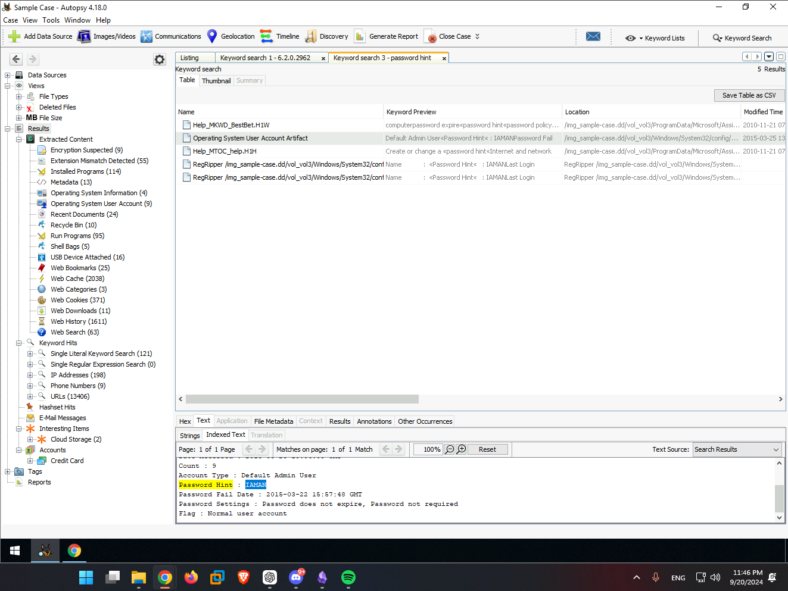
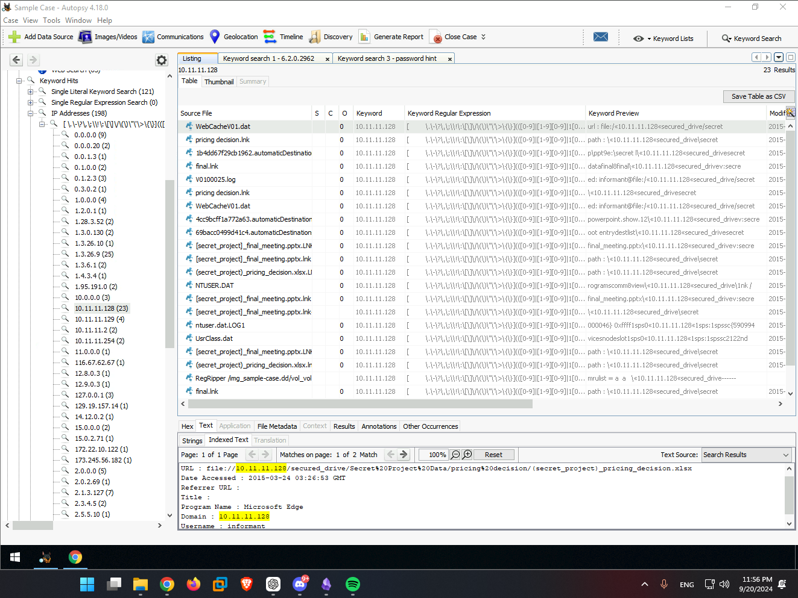
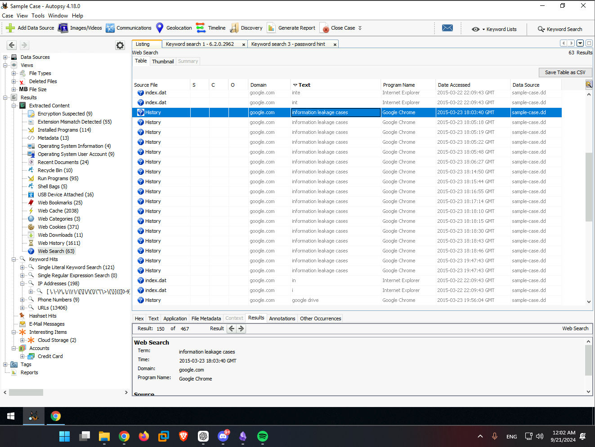
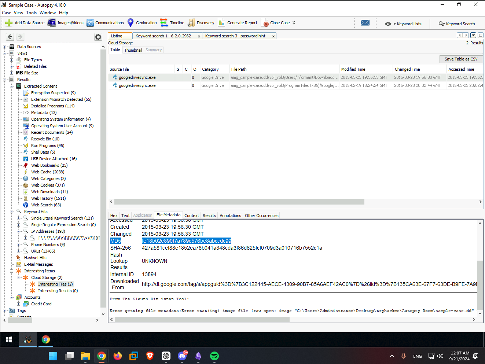
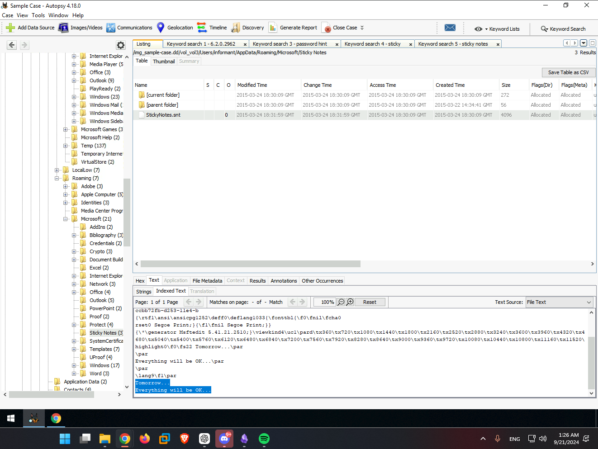

# Autopsy - Disk Analysis
Date: 09/21/2024
## Summary
[Instructions](https://tryhackme.com/r/room/btautopsye0)
Using Autopsy & the provided `.aut` file, answer the questions.

# Questions - Set 1
--------------------------
1. What is the full name of the operating system version?

```
Windows 7 Ultimate Service Pack 1
```
After browsing the tabs, I found the `Operating System Information` tab containing the answer.


2. What percentage of the drive are documents? Include the % in your answer.

```
40.8%
```


3. Generate an HTML report as shown in the task and view the "Case Summary" section.  What is the job number of the "Interesting Files Identifier" module?

```
10
```


# Questions - Set 2

**Mini Scenario**: An employee was suspected of leaking company data. A disk image was retrieved from the machine. You were assigned to perform the initial analysis. Further action will be determined based on the initial findings.

1. What is the name of an Installed Program with the version number of 6.2.0.2962?

```
Eraser
```
Using `Keyword Search`, I searched for the version number of the program and looked for `.exe` since it was asking for programs.


2. A user has a Password Hint. What is the value?

```
IAMAN
```
Searching for `password hint` pulled up the `Operating System User Account Artifact` which showed the password hint, along with more account information like password policies, groups, etc.  We can also see this is the Default Admin Account.


3. Numerous SECRET files were accessed from a network drive. What was the IP address?

```
10.11.11.128
```
Searching for internal IPs, 10.x.x.x, and taking a look at the one with the most traffic, I saw `file://10.11.11.128/secured_drive/Secret%20Project%20Data/pricing%20decision/(secret_project)_pricing_decision.xlsx`.  

If the `IP Addresses` keyword list hasn't been ran, you can do so by clicking `Keyword Lists` on the top right, near the `Keyword Search` function.

4. What web search term has the most entries?

```
information leakage cases
```
Taking a look at the `Web Search` vertical tab, I sorted the results by the text column and this had by far the most entries.


5. What was the web search conducted on 3/25/2015 21:46:44?

```
anti-forensic tools
```
Again in the search history, just sorted by Date Accessed column & find the timestamp.


6. What MD5 hash value of the binary is listed as an Interesting File?

```
fe18b02e890f7a789c576be8abccdc99
```
Searching through the `Intersting Items` vertical tab, I clicked the file, and went to the metadata tab.  The md5 and sha256 hashes were listed.


7. What self-assuring message did the 'Informant' write for himself on a Sticky Note? (no spaces)

```
Tomorrow...
Everything will be OK...
```
The path for Windows Sticky Notes is `C:\\Users\informant\AppData\Roaming\Microsoft\Sticky Notes\` and looking at the `StickNotes.snt` file:

# Sources
- [Autopsy Documentation](https://sleuthkit.org/autopsy/docs/user-docs/4.12.0/index.html)
	- This is the main doc, the rest are just quick links.
- [Autopsy Search Documentation](http://sleuthkit.org/autopsy/docs/user-docs/4.12.0/ad_hoc_keyword_search_page.html)
- The path for Windows Sticky Notes is `C:\\Users\informant\AppData\Roaming\Microsoft\Sticky Notes\`