# Investigating Windows

A windows machine has been hacked, its your job to go investigate this windows machine and find clues to what the hacker might have done.

## Instructions
This is a challenge that is exactly what is says on the tin, there are a few challenges around investigating a windows machine that has been previously compromised.

-------------------------------------------------------------
### Questions
**1. What's the version and year of the Windows machine?**
```bash
Windows Server 2016
```
`systeminfo` cmd line info would show this as well.
this was found by right clicking the Windows icon & selecting `system`
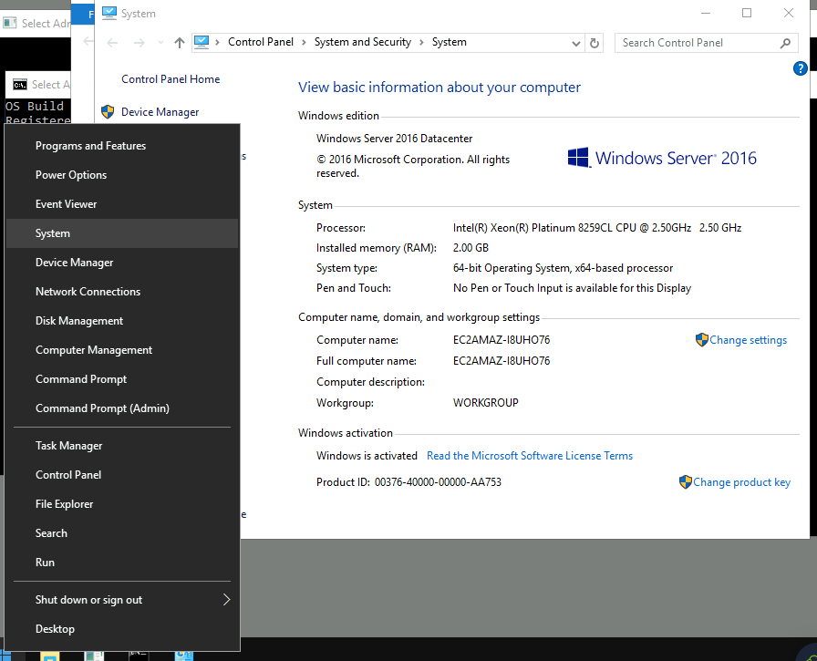

**2. Which user logged in last?**
```bash
Administrator
```
`net user <username>` & comparing will show this, but let use event viewer.

In the event viewer event id: `4672` is for privileges assigned to a new logon.  After filtering & searching the Security logs we see the Administrator is the last non-system account to logon.
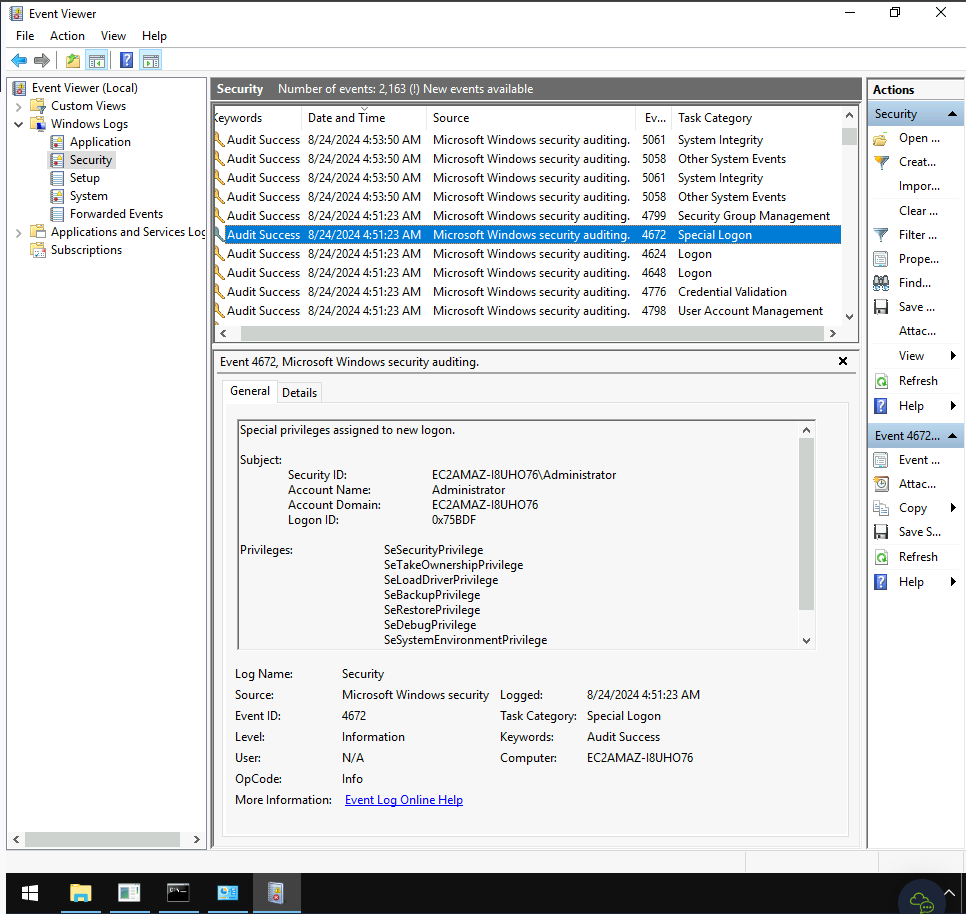

**3. When did John log onto the system last? - Answer format: MM/DD/YYYY H:MM:SS AM/PM**
```plaintext
03/02/2019 5:48:32 PM
```
filter logs by event or `net user john` 

**4. What IP does the system connect to when it first starts?**
```plaintext
10.34.2.3
```
looking at the registry for autorun applications, we see `UpdateSvc` starting a file in the `TMP` directory named `p.exe` with command line arguments including an IP address.
Registry location is: `HKEY_LOCAL_MACINE\SOFTWARE\Microsoft\Windows\CurrentVersion\Run` 
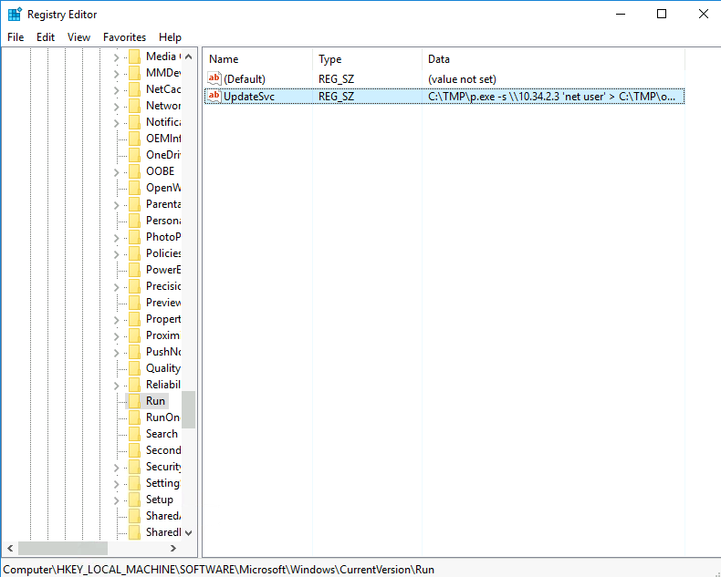<br>

**5. What two accounts had administrative privileges (other than the Administrator user)?**
```bash
Jenny, Guest
```

```bash
net localgroup Administrators
```

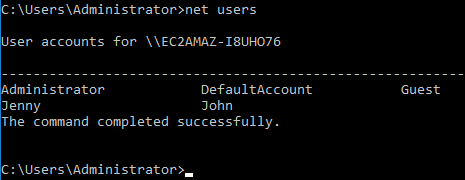<br>

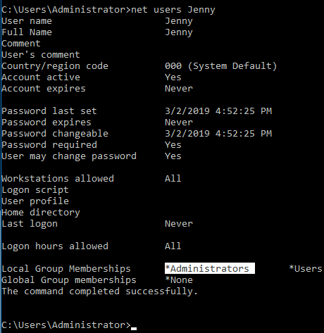<br>
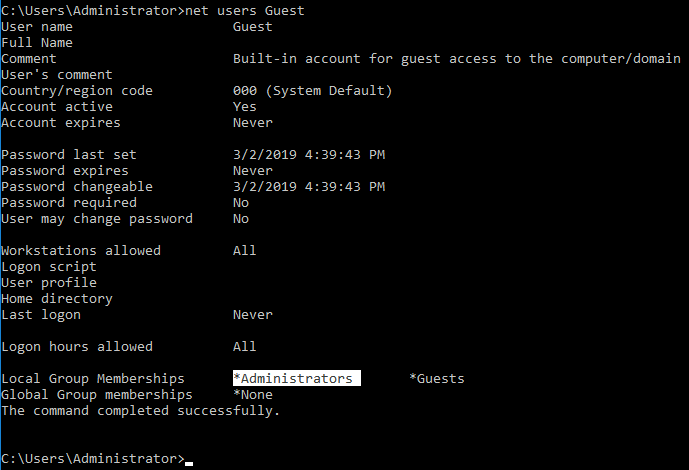<br>
6. What's the name of the scheduled task that is malicious?
```bash
clean file system
```
Using `Task Scheduler` we can see all of the tasks, upon inspection of a task named `Clean file system` was set to start a program `C:\TMP\nc.ps1` which upon inspection is `powercat`. 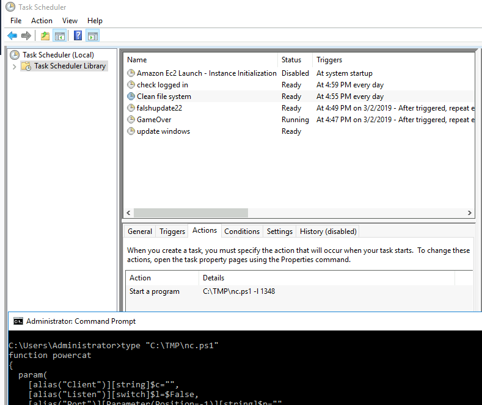

7. What file was the task trying to run daily?
```bash
nc.ps1
```
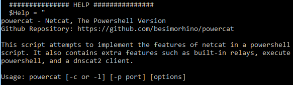<br>

8. What port did this file listen locally for?
```bash
1348
```
This was stated in the Task Scheduler command as well.

9. When did Jenny last logon?
```bash
Never
```
`net user Jenny` would show this, but lets use event viewer.
I searched through all the filtered events with event ID of `4672` and used the Find function to try and find Jenny with no results. <br>
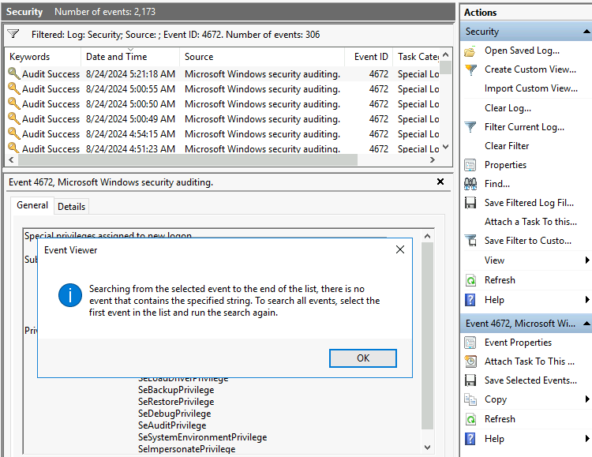<br>


10. At what date did the compromise take place?
```plaintext
03/02/2019
```
The malicious task was created on 03/02/2019.<br>
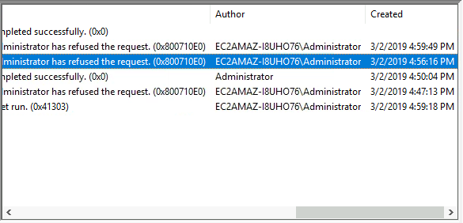<br>

11. During the compromise, at what time did Windows first assign special privileges to a new logon?
```plaintext
03/02/2019 04:04:49 PM
```

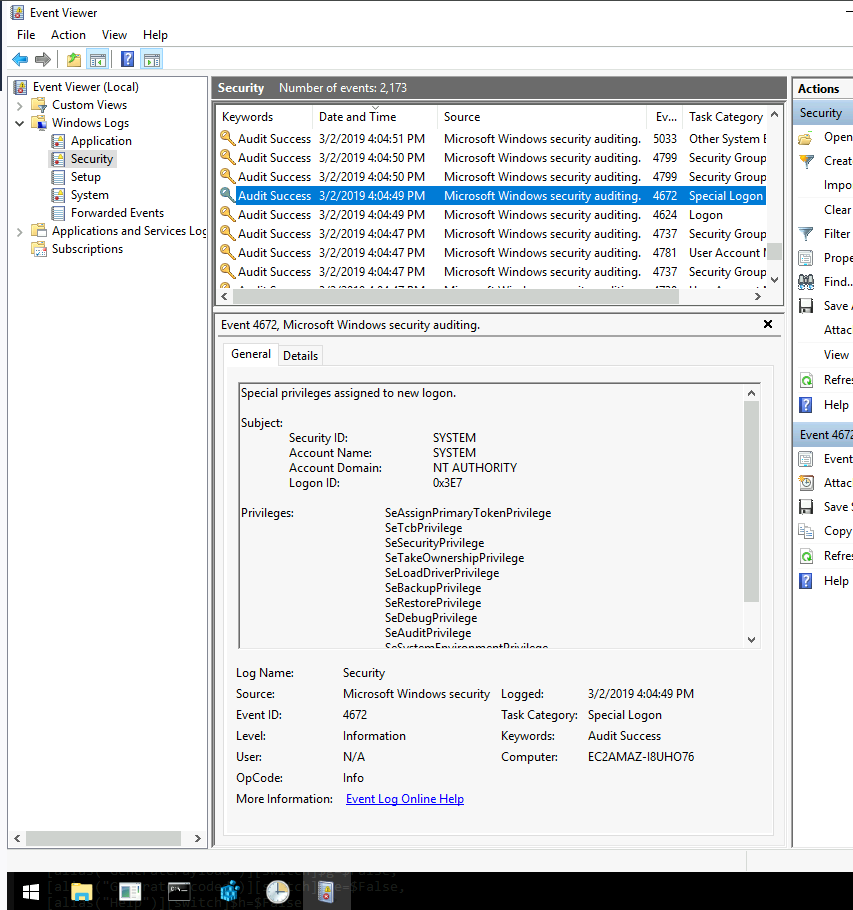<br>

12. What tool was used to get Windows passwords?
```bash
mimikatz
```
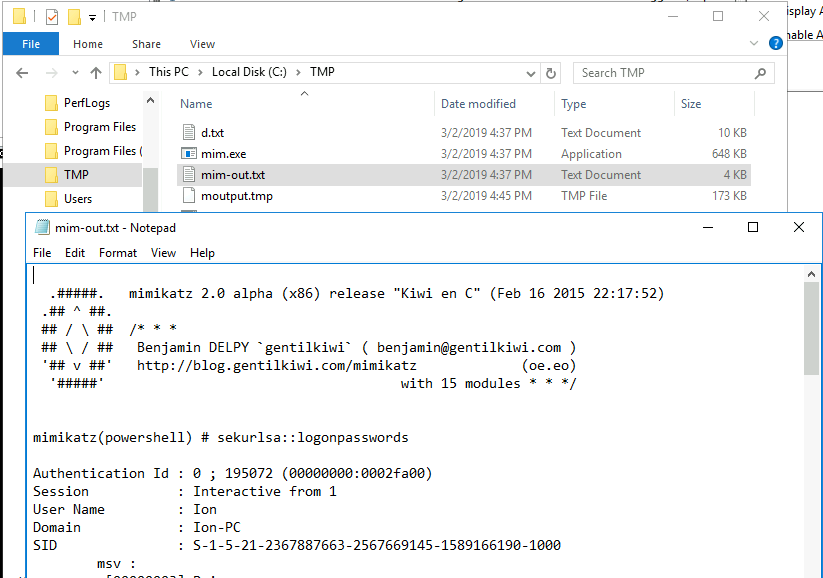<br>
Found this in the TMP directory.

13. What was the attacker's external control and command server's IP?
```plaintext
76.32.97.132
```

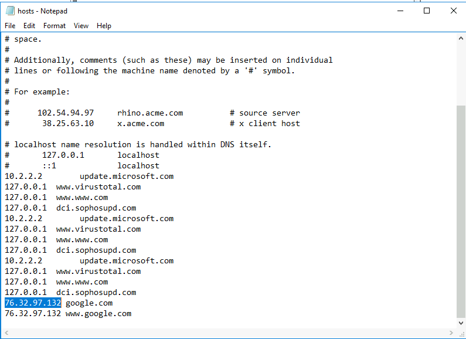<br>
This was the only external IP in the hosts file, redirecting google.com to `76.32.97.132`<br>

14. What was the extension name of the shell uploaded via the server's website?
```bash
.jsp
```

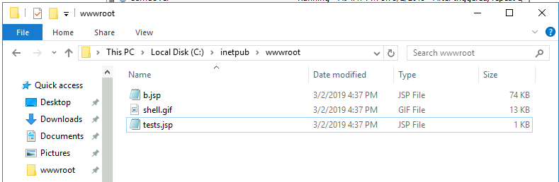<br>

15. What was the last port the attacker opened?
```plaintext
1337
```
Inside the firewall, when filtering the rules for `rules with no group` a very suspicious looking firewall rule called `Allow out connections for development` & opens port `1337`. <br>

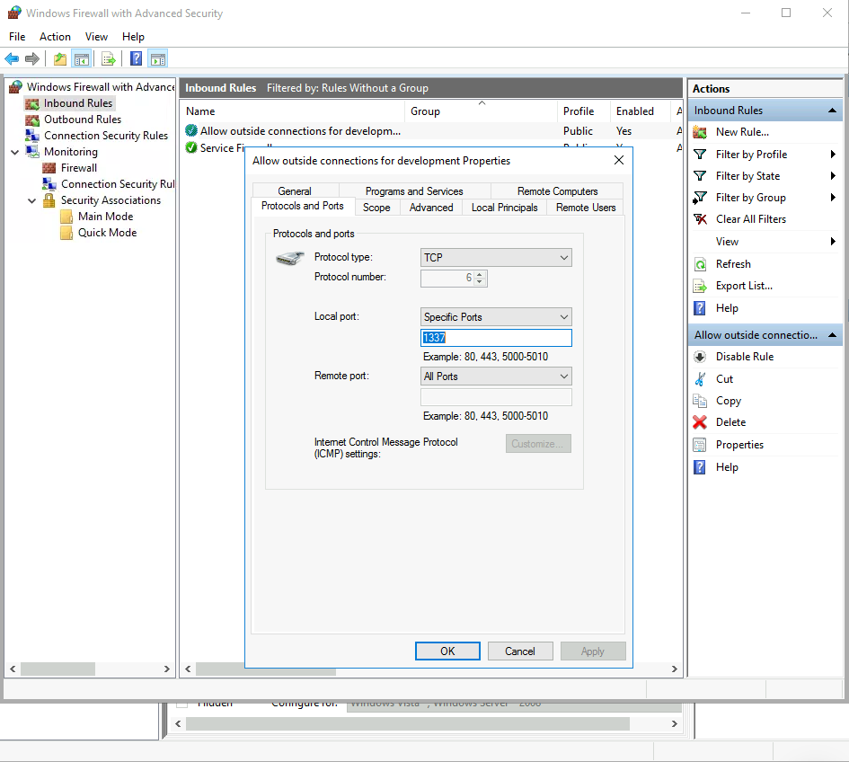<br>

16. Check for DNS poisoning, what site was targeted?
```bash
google.com
```
hosts file screenshot above.

------------------------

Notes / Takeaways:

```cmd 
systeminfo # OS info
net users # lists users
net localgroup Administrators # lists Admins
net user username # shows user detailed info like last logon, & more;
```

+ Windows Event logger - Event ID: 4672 is privileges assigned to a new logon.  Useful to find last logged in user on a windows machine.
+ Check firewall for inbound rules -> filtered by group -> Rules without a group (at the bottom)
+ `HKEY_LOCAL_MACINE\SOFTWARE\Microsoft\Windows\CurrentVersion\Run` for startup applications