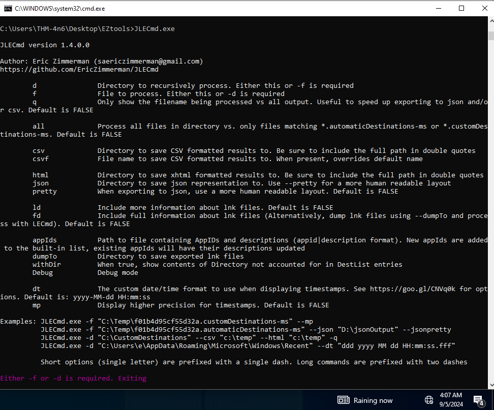

# Windows Forensics 2 - Walkthrough

## **The NTFS file System**

As observed in the previous task, the FAT file system is a very basic file system. It does the job when it comes to organizing our data, but it offers little more in terms of security, reliability, and recovery capabilities. It also has certain limitations when it comes to file and volume sizes. Hence, Microsoft developed a newer file system called the New Technology File System (NTFS) to add these features. This file system was introduced in 1993 with the Windows NT 3.1. However, it became mainstream since Windows XP. The NTFS file system resolves many issues present in the FAT file system and introduces a lot of new features. We will discuss some of the features below.

### Journaling

The NTFS file system keeps a log of changes to the metadata in the volume. This feature helps the system recover from a crash or data movement due to defragmentation. This log is stored in $LOGFILE in the volume's root directory. Hence the NTFS file system is called a journaling file system.

### Access Controls

The FAT file system did not have access controls based on the user. The NTFS file system has access controls that define the owner of a file/directory and permissions for each user.

### Volume Shadow Copy

The NTFS file system keeps track of changes made to a file using a feature called Volume Shadow Copies. Using this feature, a user can restore previous file versions for recovery or system restore. In recent ransomware attacks, ransomware actors have been noted to delete the shadow copies on a victim's file systems to prevent them from recovering their data.

### Alternate Data Streams

A file is a stream of data organized in a file system. Alternate data streams (ADS) is a feature in NTFS that allows files to have multiple streams of data stored in a single file. Internet Explorer and other browsers use Alternate Data Streams to identify files downloaded from the internet (using the ADS Zone Identifier). Malware has also been observed to hide their code in ADS.

## **Master File Table**

Like the File Allocation Table, there is a Master File Table in NTFS. However, the Master File Table, or MFT, is much more extensive than the File Allocation Table. It is a structured database that tracks the objects stored in a volume. Therefore, we can say that the NTFS file system data is organized in the Master File Table. From a forensics point of view, the following are some of the critical files in the MFT:

### $MFT

The $MFT is the first record in the volume. The Volume Boot Record (VBR) points to the cluster where it is located. $MFT stores information about the clusters where all other objects present on the volume are located. This file contains a directory of all the files present on the volume.

### $LOGFILE

The $LOGFILE stores the transactional logging of the file system. It helps maintain the integrity of the file system in the event of a crash.

### $UsnJrnl

It stands for the Update Sequence Number (USN) Journal. It is present in the $Extend record. It contains information about all the files that were changed in the file system and the reason for the change. It is also called the change journal.

### MFT Explorer

MFT Explorer is one of Eric Zimmerman's tools used to explore MFT files. It is available in both command line and GUI versions. We will be using the CLI version for this task.

Start the machine attached with the task. It will open in the split view. If preferred, login to the machine through RDP using the following credentials:

Username: thm-4n6

Password: 123

---------------------
### Questions

**1. Parse the $MFT file placed in C:\users\THM-4n6\Desktop\triage\C\ and analyze it. What is the Size of the file located at .\Windows\Security\logs\SceSetupLog.etl?**  

```
49152
```

<br>MFTECmd parses data from the different files created by the NTFS file system like $MFT, $Boot, etc. The above screenshot shows the available options for parsing MFT files. For parsing the $MFT file, we can use the following command:
`MFTECmd.exe -f <path-to-$MFT-file> --csv <name-of-dir>`

<br>Using `EZViewer` I used `ctrl + f` to search for `SceSetupLog.etl` and found the file size.  
**2. What is the size of the cluster for the volume from which this triage was taken?**  

```
4096
```

Using the hint, to parse the $Boot file, this was the output:<br>

Below is a screenshot of the available `Master File Table Objects`:<br>
# Recovering Deleted Files
--------------------------------------
source: https://tryhackme.com/r/room/windowsforensics2 - Deleted Files & Data Recovery

Understanding the file systems makes it easier to know how files are deleted, recovered, and wiped. As we learned in the previous two tasks, a file system stores the location of a file on the disk in a table or a database. When we delete a file from the file system, the file system deletes the entries that store the file's location on the disk. For the file system, the location where the file existed is now available for writing or unallocated. However, the file contents on disk are still there, as long as they are not overwritten by the file system while copying another file or by the disk firmware while performing maintenance on the disk.

Similarly, there is data on the disk in different unallocated clusters, which can possibly be recovered. To recover this data, we have to understand the file structure of different file types to identify the specific file through the data we see in a hex editor. However, we will not cover that in this room. What we will do, is to use a tool that does this work for us and identifies deleted files in a disk image file. But what is a disk image file?

Disk Image:
A disk image file is a file that contains a bit-by-bit copy of a disk drive. A bit-by-bit copy saves all the data in a disk image file, including the metadata, in a single file. Thus, while performing forensics, one can make several copies of the physical evidence, i.e., the disk, and use them for investigation. This helps in two ways. 1) The original evidence is not contaminated while performing forensics, and 2) The disk image file can be copied to another disk and analyzed without using specialized hardware.

Recovering files using Autopsy
With that out of the way, let's see how we can recover deleted files from a disk. We will use Autopsy for recovering deleted files. For a room dedicated to Autopsy, you can go here.

## Questions

1. **There is another xlsx file that was deleted. What is the full name of that file?**

```
   Tryhackme.xlsx
```

<br>Used Autopsy to view deleted files, by right clicking any of these and selecting extract we can see the contents.

2. **What is the name of the TXT file that was deleted from the disk?**

  ```
   TryHackMe2.txt
  ```

3. **Recover the TXT file from Question #2. What was written in this txt file?**

   ```
   thm-4n6-2-4
   ```
	
	

# Evidence of Execution

## Windows Prefetch files

When a program is run in Windows, it stores its information for future use. This stored information is used to load the program quickly in case of frequent use. This information is stored in prefetch files which are located in the `C:\Windows\Prefetch` directory.

Prefetch files have an extension of `.pf`. Prefetch files contain the last run times of the application, the number of times the application was run, and any files and device handles used by the file. Thus it forms an excellent source of information about the last executed programs and files.

We can use Prefetch Parser (PECmd.exe) from Eric Zimmerman's tools for parsing Prefetch files and extracting data.

<br>
To run Prefetch Parser on a file and save the results in a CSV, we can use the following command:

`PECmd.exe -f <path-to-Prefetch-files> --csv <path-to-save-csv>`  

Similarly, for parsing a whole directory, we can use the following command:

`PECmd.exe -d <path-to-Prefetch-directory> --csv <path-to-save-csv>`

We can use this information to answer the questions at the end.

## Windows 10 Timeline

Windows 10 stores recently used applications and files in an SQLite database called the Windows 10 Timeline. This data can be a source of information about the last executed programs. It contains the application that was executed and the focus time of the application. The Windows 10 timeline can be found at the following location:

`C:\Users\<username>\AppData\Local\ConnectedDevicesPlatform\{randomfolder}\ActivitiesCache.db`

We can use Eric Zimmerman's WxTCmd.exe for parsing Windows 10 Timeline. We get the following options when we run it:


We can use the following command to run WxTCmd:
`WxTCmd.exe -f <path-to-timeline-file> --csv <path-to-save-csv>`

## Windows Jump Lists

Windows introduced jump lists to help users go directly to their recently used files from the taskbar. We can view jumplists by right-clicking an application's icon in the taskbar, and it will show us the recently opened files in that application. This data is stored in the following directory:

`C:\Users\<username>\AppData\Roaming\Microsoft\Windows\Recent\AutomaticDestinations`

Jumplists include information about the applications executed, first time of execution, and last time of execution of the application against an AppID.

We can use Eric Zimmerman's JLECmd.exe to parse Jump Lists. We get the following options when we run it:



We can use the following command to parse Jumplists using JLECmd.exe:
`JLECmd.exe -f <path-to-Jumplist-file> --csv <path-to-save-csv>`

In the folder named `triage`, present on the Desktop of the attached machine, we have extracted the Windows directory of a system we want to investigate. It retains the directory structure of the original Windows directory, that is, `C:\Windows` directory from the system is mapped on to `C:\users\thm-4n6\Desktop\triage\C\Windows`. Now let's use the information we have learned to perform analysis on the data saved in the folder named `triage` on the Desktop in the attached VM and answer the following questions.

If you are having trouble viewing the CSV file, you can use EZviewer from the EZtools folder.
## Questions

1. **How many times was gkape.exe executed?**

   ```
   2
   ```

2. **What is the last execution time of gkape.exe?**

   ```
   12/01/2021 13:04
   ```

3. **When Notepad.exe was opened on 11/30/2021 at 10:56, how long did it remain in focus?**

   ```
   00:00:41
   ```

4. **What program was used to open C:\Users\THM-4n6\Desktop\KAPE\KAPE\ChangeLog.txt?**

   ```
   Notepad.exe
   ```

# File / Folder knowledge
## Shortcut Files

Windows creates a shortcut file for each file opened either locally or remotely. The shortcut files contain information about the first and last opened times of the file and the path of the opened file, along with some other data. Shortcut files can be found in the following locations:

`C:\Users\<username>\AppData\Roaming\Microsoft\Windows\Recent\`

`C:\Users\<username>\AppData\Roaming\Microsoft\Office\Recent\`

We can use Eric Zimmerman's LECmd.exe (Lnk Explorer) to parse Shortcut files. When we run the LECmd.exe, we see the following options:
 

We can use the following command to parse shortcut files using LECmd.exe:
`LECmd.exe -f <path-to-shortcut-files> --csv <path-to-save-csv>`

# IE/Edge history

An interesting thing about the IE/Edge browsing history is that it includes files opened in the system as well, whether those files were opened using the browser or not. Hence, a valuable source of information on opened files in a system is the IE/Edge history. We can access the history in the following location:

`C:\Users\<username>\AppData\Local\Microsoft\Windows\WebCache\WebCacheV*.dat`

The files/folders accessed appear with a `file:///*` prefix in the IE/Edge history. Though several tools can be used to analyze Web cache data, you can use Autopsy to do so in the attached VM. For doing that, select Logical Files as a data source.

Sources:  
- [Microsoft NTFS Reserved File Names](https://learn.microsoft.com/en-us/openspecs/windows_protocols/ms-fscc/b04c3bd0-79dc-4e58-b8ed-74f19fc2ea0a) and deduced that the since the $MftMirr (Mft Mirror) was a backup copy of the entire file system (first four MFT including $MFT), and is typically used to cross reference for any manipulation.

### Summary:

- **$MftMirr** is the Master File Table Mirror, a backup copy of the first few entries of the $MFT on an NTFS volume.
- It exists to provide redundancy and help maintain file system integrity in the event of corruption or damage to the $MFT.
- In a forensic context, examining the $MftMirr can be crucial when analyzing a potentially damaged NTFS volume to recover critical metadata.


- https://tryhackme.com/r/room/windowsforensics2