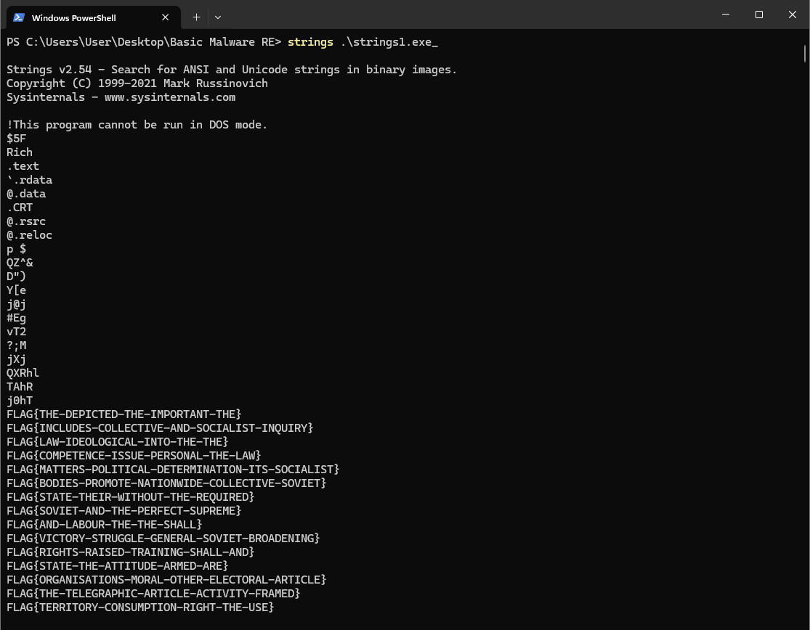
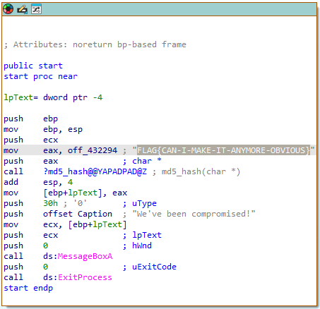
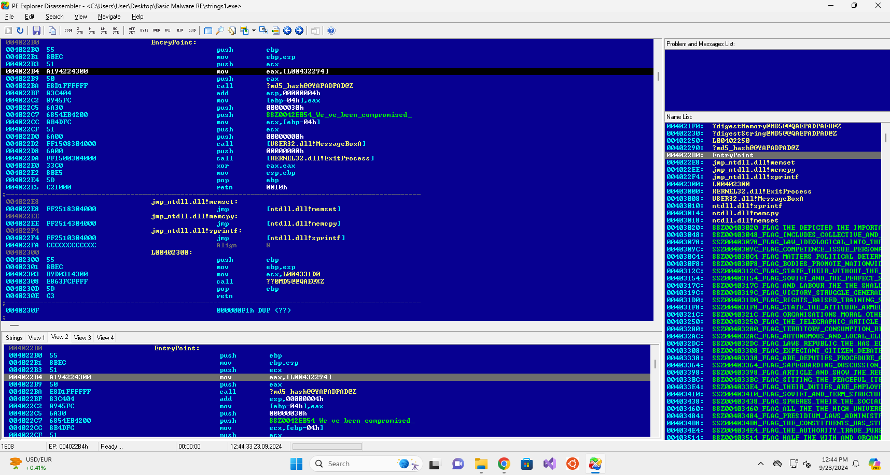
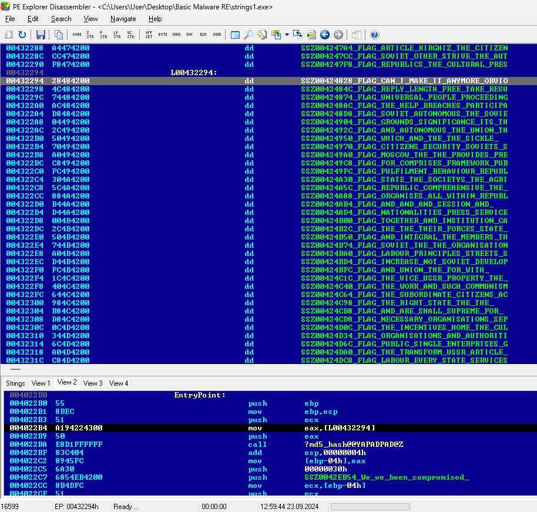
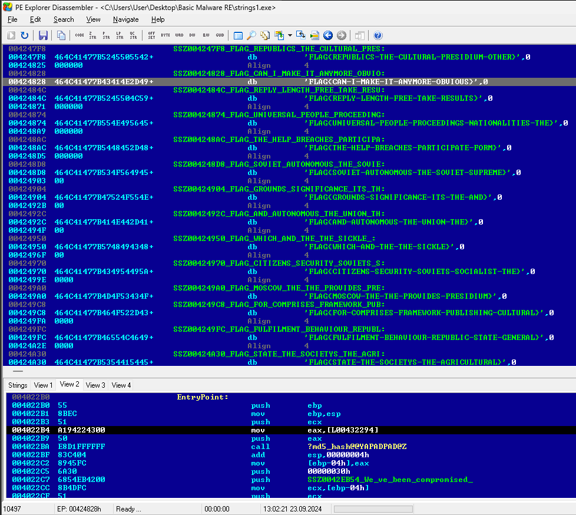

# Summary
Date: 09/23/2024
[Instructions](https://tryhackme.com/r/room/basicmalwarere)

These challenges are aimed towards learning about the "Static Analysis" technique used to analyze the malware. The main aim for this room is not to used any types of debuggers neither the executable's/programs should be run on any platform. You are required to answer all the questions without even using the debugger and even not executing the executable's/programs.

Meanwhile all the credits goes to @MalwareTechBlog for creating these awesome challenges. 

Note:  Password for the ZIP is `MalwareTech`

# Strings :: Challenge 1

## Summary
This executable prints a MD5 Hash on the screen when executed. Can you grab the exact flag?

Note: You don't need to run the executable!

## Questions

1. What is the flag of which that MD5 gets generated?

```
FLAG{CAN-I-MAKE-IT-ANYMORE-OBVIOUS}
```
Considering the name of the challenge, the first thing I did was run `strings`, from the [Sysinternals Suite.](https://learn.microsoft.com/en-us/sysinternals/downloads/)  Although, the results were not promising.

Okay, so strings shows way more than 1 flag, more like hundreds.  Since entering them 1 by 1 doesn't sound like too much fun, lets load the binary into IDA & see if we can learn anything else.

Immediately upon opening the `strings1.exe_` file, we see offset_432294 `off_432294` being moved onto the `eax` register.   IDA places the comment, showing the value of the flag prior to being sent to the md5 hashing function.

Another option is using `PE Explorer` to view the disassembled executable.  Upon opening the executable, it takes us to the `EntryPoint`.  

In the main window, the top left window that says `EntryPoint:`,  by double-clicking the line, it takes us to another screen:

From here, we can see the `00432294` memory address & almost make out the flag.  By double-clicking the line with that memory address again, we get to another screen.

Here we finally see the entirety of the string for the flag, `FLAG{CAN-I-MAKE-IT-ANYMORE-OBVIOUS}`.

# Strings :: Challenge 2

## Summary

This executable prints an MD5 Hash on the screen when executed. Can you grab the exact flag?

Note: You don't need to run the executable!

## Questions

1. What is the flag of which that MD5 gets generated?

```
FLAG{CAN-I-MAKE-IT-ANYMORE-OBVIOUS}
```

# Strings :: Challenge 3

This executable prints an MD5 Hash on the screen when executed. Can you grab the exact flag?

Note: You don't need to run the executable!

## Questions

1. What is the flag of which that MD5 gets generated?
  
```
FLAG{RESOURCES-ARE-POPULAR-FOR-MALWARE}
```


# Sources
- [THM Instructions](https://tryhackme.com/r/room/basicmalwarere)
- 