Date - 09/23/2024

# Summary
In the attached VM, there is an Autopsy case file and its corresponding disk image. After loading the .aut file, make sure to re-point Autopsy to the disk image file.

  

Ingest Modules were already ran for your convenience.

Your task is to perform a manual analysis of the artifacts discovered by Autopsy to answer the questions below.  

This room should help to reinforce what you learned in the Autopsy room. Have fun investigating!

# Questions

1. What is the MD5 hash of the E01 image?

```
3f08c518adb3b5c1359849657a9b2079
```
Selecting `HASAN2.E01` data source, going to the summary -> container tab shows the md5 hash.
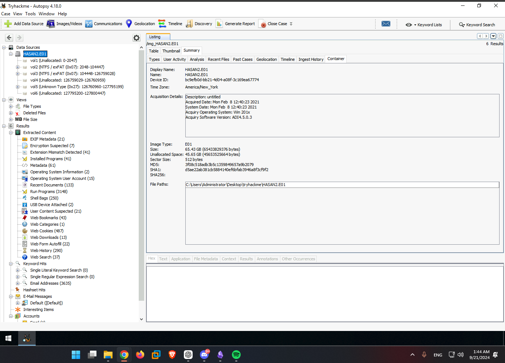

2. What is the computer account name?

```
DESKTOP-0R59DJ3
```
Under the `Operating System Information` vertical tab, the name is listed:
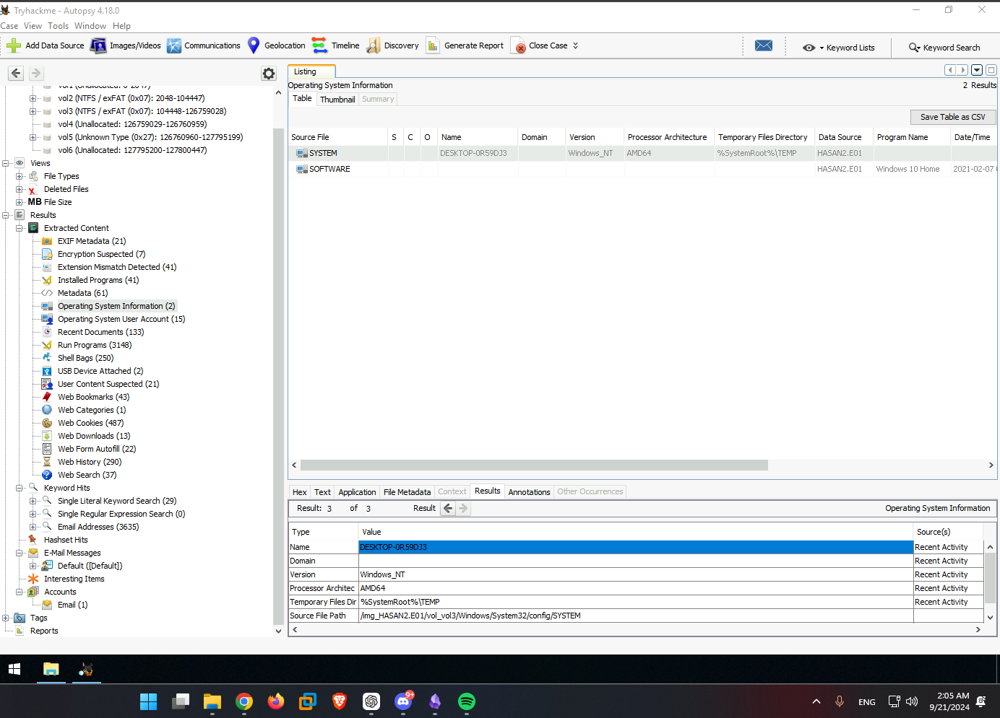

3. List all the user accounts. (alphabetical order)

```
H4S4N, joshwa, keshav, sandhya, shreya, sivapriya, srini, suba
```
Under the `Operating System User Account` vertical tab, the names are listed:
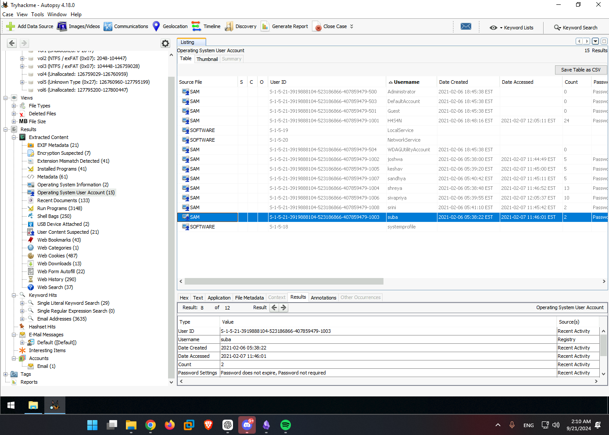
The `Date Accessed` column is useful for determining accounts that have ever been accessed on the device.  I also just sorted them by Username to get the correct order.

4. Who was the last user to log into the computer?

```
sivapriya
```
Sort the above image by the `Date Accessed` column.

5. What was the IP address of the computer?

```
192.168.130.216
```
First I checked the registry files by navigating to `Windows/System32/config`, selecting the `SYSTEM` hive & navigating to `CurrentControlSet\Services\Tcpip\Parameters\Interfaces` on the `Application` horizontal tab:
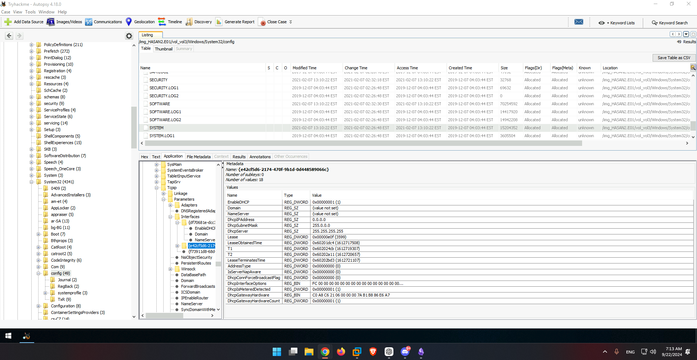
Unfortunately, the IP address field `DhcpIPaddress` is set to 0.0.0.0 which is pointed back at itself (loopback), after some snooping around I found a program installed `Look@LAN`. 

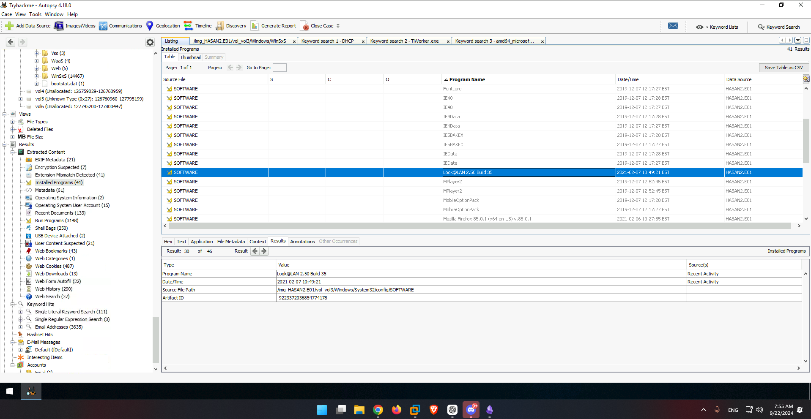

Upon inspection of the installation folder, I found an `irunin.ini` file (an initialization file).  When looking at the text for this file, we can see the IP & MAC address it used.

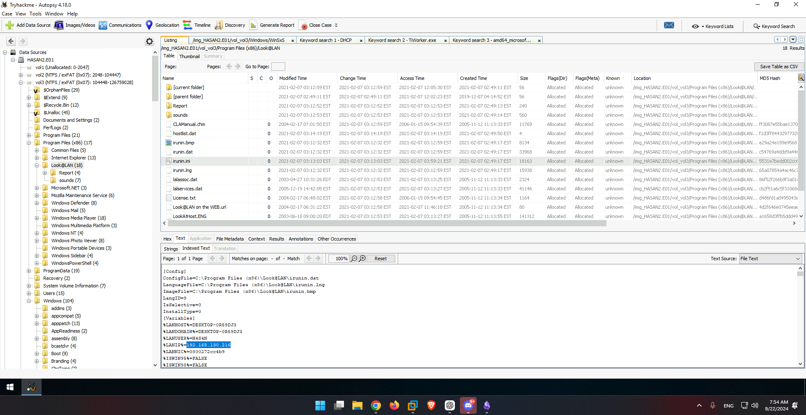
6. What was the MAC address of the computer? (XX-XX-XX-XX-XX-XX)

```
08-00-27-2c-c4-b9
```
This is listed immediately underneath the IP address in the previous screenshot.  Just have to add the dashes.

7. What is the name of the network card on this computer?

```
Intel(R) PRO/1000 MT Desktop Adapter
```
Looking for the `SOFTWARE\Microsoft\Windows NT\CurrentVersion\NetworkCards` 
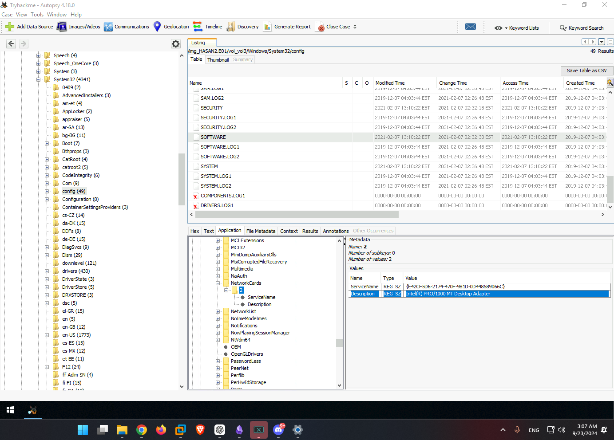
8. What is the name of the network monitoring tool?

```
Look@LAN
```
This was discovered above when searching for the IPv4 address.

9. A user bookmarked a Google Maps location. What are the coordinates of the location?

```
12°52'23.0"N 80°13'25.0"E
```
Looking at the bookmarks, there was only one for google maps.
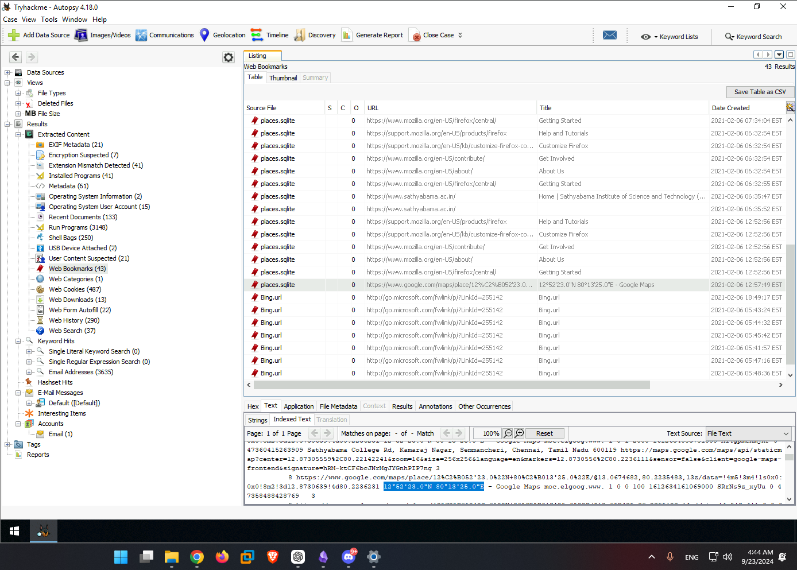

10. A user has his full name printed on his desktop wallpaper. What is the user's full name?

```
Anto Joshwa
```
In another users downloads folder, we find a cyberpunk desktop background with text added to the top right of the image saying: `Anto Joshwa` - In the main `Web Downloads` folder we see a few different options that could be background images.  
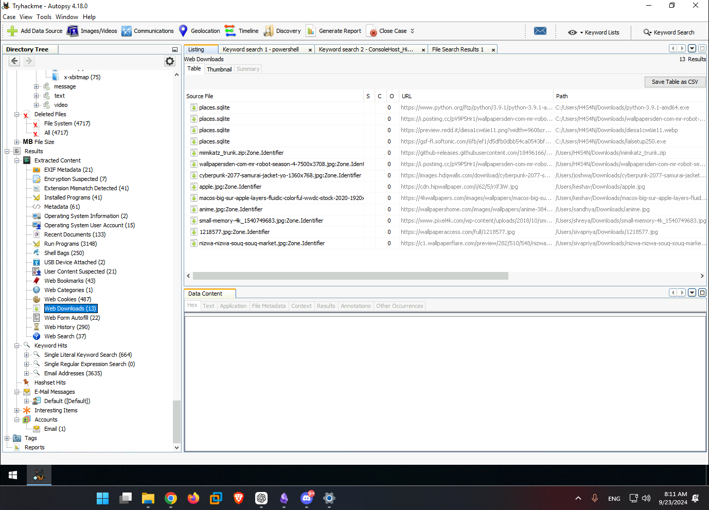
Notice how most of the entries has `:Zone.Identifier` after it.  This is just `Autopsy` marking the file as downloaded from the web, double-click it, and it will take you to the file location where you can see an image preview.
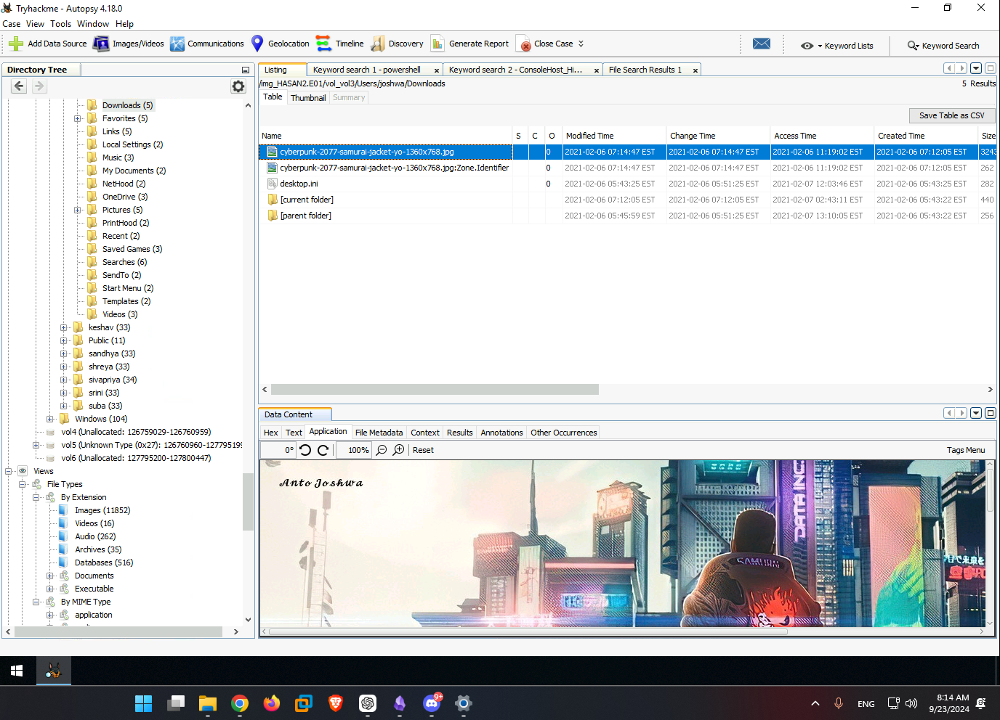
Zoom into the image, and we see the full name of the user.

11. A user had a file on her desktop. It had a flag but she changed the flag using PowerShell. What was the first flag?

```
flag{HarleyQuinnForQueen}
```
In the `C:\\Users\shreya\AppData\Romaing\Microsoft\Windows\PowerShell\PSReadLine\ConsoleHost_History.txt` file would show all of the previous PowerShell commands ran for each user.  Upon inspection of user `shreya` `ConsoleHost_History.txt` file, we can see the flag.
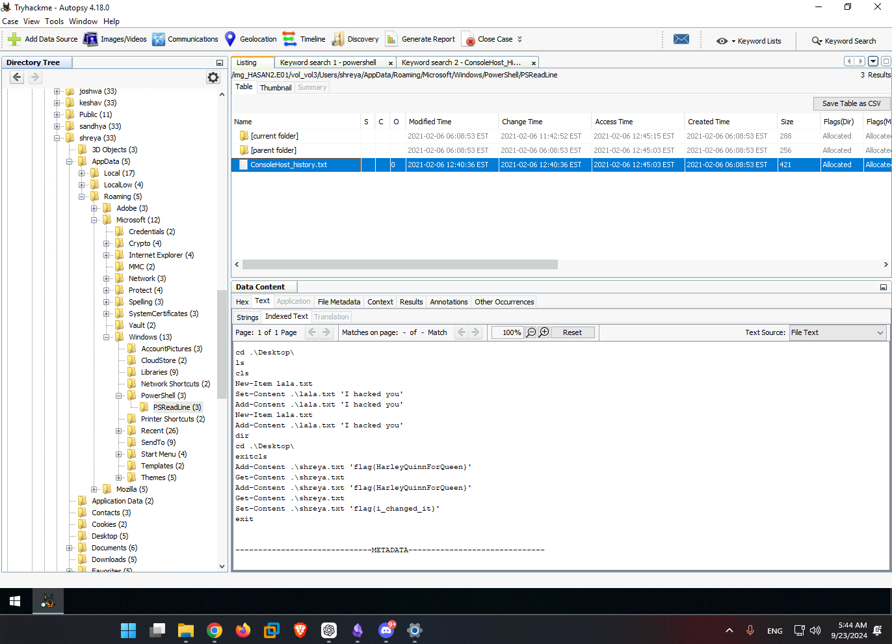

12. The same user found an exploit to escalate privileges on the computer. What was the message to the device owner?

```
flag{i-hacked-you}
```
In the above screenshot, we see a file `lala.txt` located on the Desktop.  When going to inspect the document, I found a PowerShell script `exploit.ps1` & inside we see comments indicating where to place the payload & also the flag we are looking for.
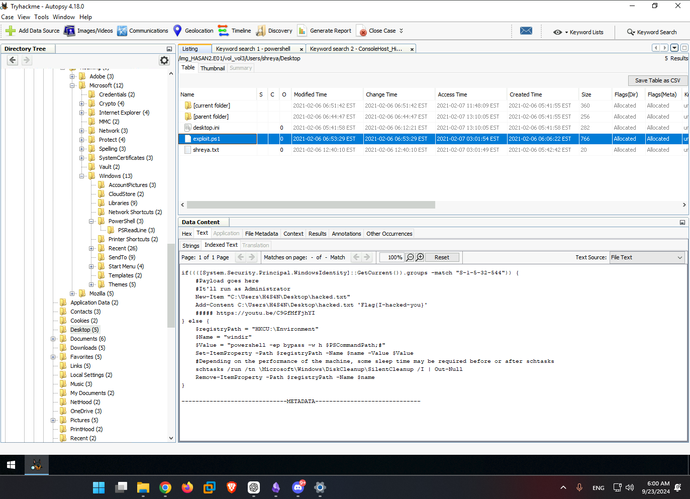

13. 2 hack tools focused on passwords were found in the system. What are the names of these tools? (alphabetical order)

```
LaZagne, Mimikatz
```
There has already been references to `mimikatz` throughout our investigation, so I know that is one.  The other one wasn't immediately decipherable.  After searching through the installed applications, downloads folders, and not finding anything, I decided to lookup windows defender scan results.  Located at  `ProgramData/Microsoft/Windows Defender/Scans/History/Service/DetectionHistory` for all the files that Windows Defender found during the scan.  Sure enough, there is an additional `HackTool` called `lazagne.exe` that was downloaded to the Downloads folder for user `H4S4N`.  
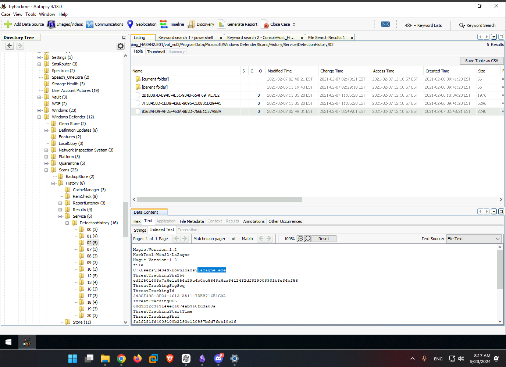

14. There is a YARA file on the computer. Inspect the file. What is the name of the author?

```
Benjamin DELPHY (gentilkiwi)
```
From the [Redline & IOC Editor](Redline%20&%20IOC%20Editor.md) lab I know that an Yara file extension is either `.yar` or `.yara`.  I searched by file attribute by selecting it from the tools menu & found the file.
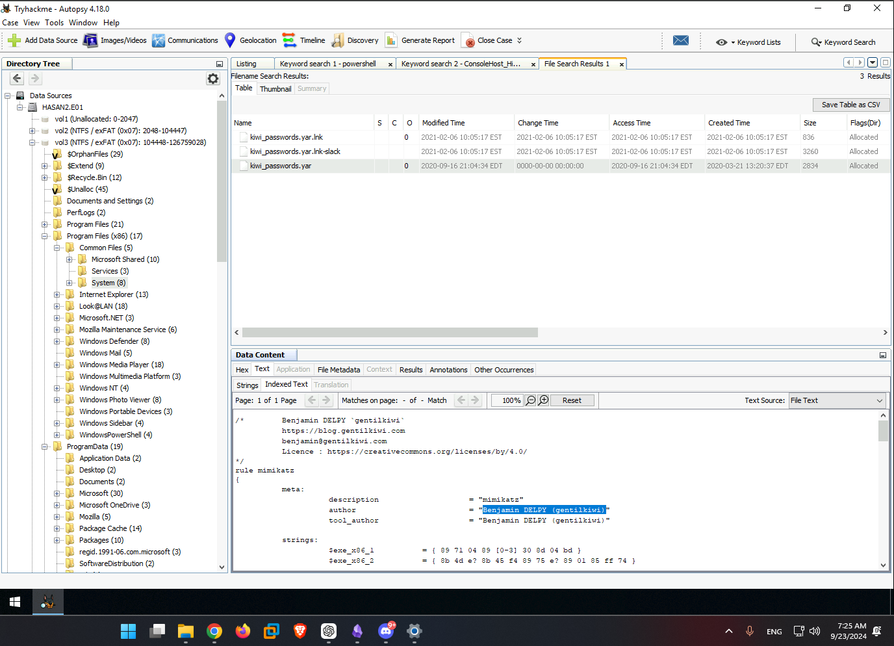

15. One of the users wanted to exploit a domain controller with an MS-NRPC based exploit. What is the filename of the archive that you found? (include the spaces in your answer)

```
2.2.0 20200918 Zerologon encrypted.zip
```
Per Google, a common MS-NRPC exploit is `ZeroLogon`, which I've actually used in a prior lab.
Browsing the `Recent Documents` tab I found a file with Zerologon in it.
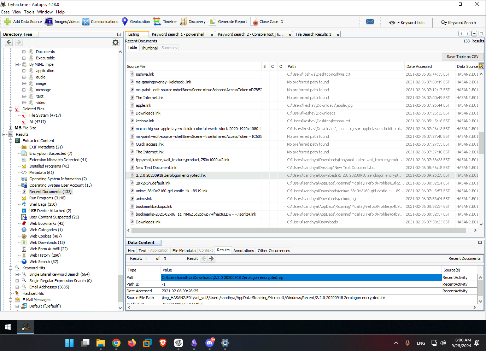

# Sources & Tips
- Go to `Windows\System32\config` to see data HIVE's
	- SYSTEM hive - (Go to horizontal `Application` tab after selecting hive)
		- `CurrentControlSet\Services\Tcpip\Parameters\Interfaces` should show networking interface configuration.  Domain, IP Address, DNS, DHCP server.
			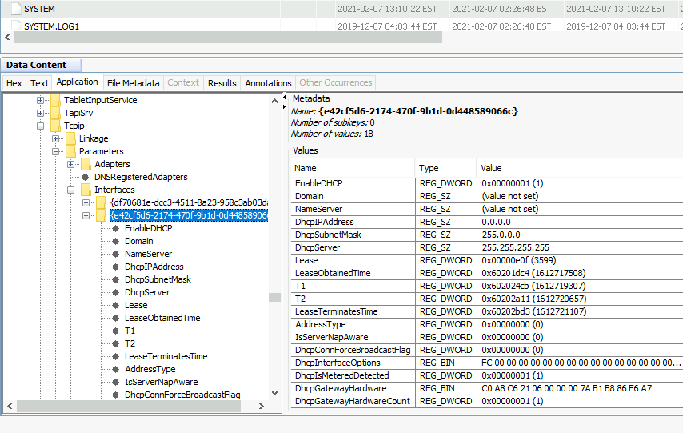
	- SOFTWARE hive
		- `SOFTWARE\Microsoft\Windows NT\CurrentVersion\NetworkCards` to show network card names / vendor.
- The `File Types -> By Extension -> Archives` is very useful for finding well, archived content;
- View PowerShell history at: `C:\\Users\username\AppData\Romaing\Microsoft\Windows\PowerShell\PSReadLine\ConsoleHost_History.txt` 
- `Recent Documents` tab has really useful information, especially pertaining to what happened last.  
- Right clicking files allows you to view them in a timeline fashion which can be useful.