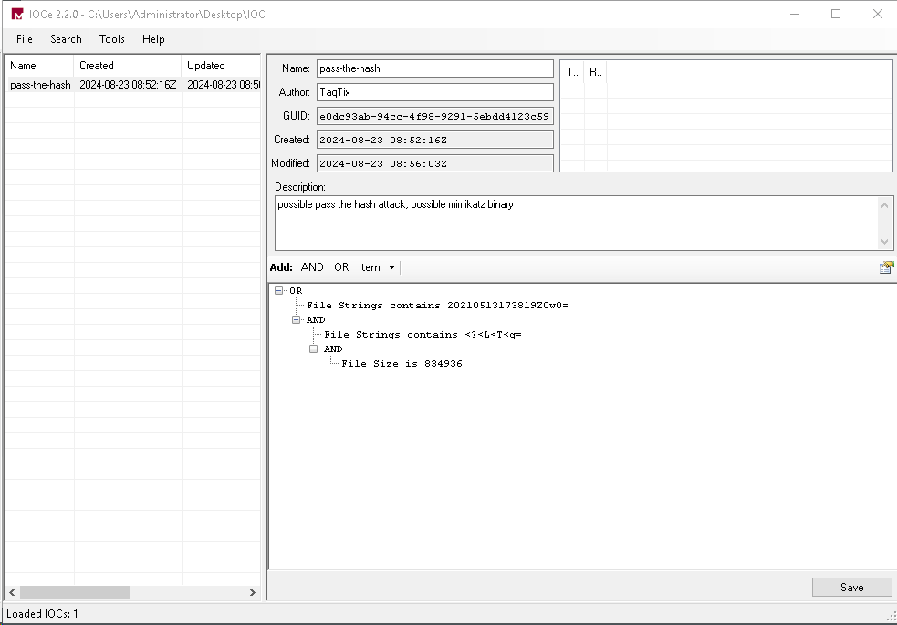

# About
TryHackMe exercise to learn how to use [Redline](https://fireeye.market/apps/211364) & [IOC Editor](https://fireeye.market/assets/apps/S7cWpi9W//9cb9857f/ug-ioc-editor.pdf) for Incident Response Scenarios.  
[Instructions Here. (THM website)](https://tryhackme.com/r/room/btredlinejoxr3d)

[Redline User-Guide Best Practices Section (pdf).](https://fireeye.market/assets/apps/211364/documents/877936_en.pdf#page=94)
[Mandiant IOC Editor User Guide (pdf)](https://fireeye.market/assets/apps/S7cWpi9W//9cb9857f/ug-ioc-editor.pdf)
[Redline & IOC Editor](#Sources)

In this exercise, I used [Redline](https://fireeye.market/apps/211364) to create collectors to obtain and analyze memory from an infected windows computer.  I also use [Mandiant IOC Editor](https://fireeye.market/assets/apps/S7cWpi9W//9cb9857f/ug-ioc-editor.pdf) to create an IOC & scan it against collected data.  Via RDP, connected to Windows VM & used pre-installed Redline & IOC Editor to answer Exam Questions.

```table-of-contents
```

------------------------------------------
# Part 1 - Create a Standard Collector

## Types of Collectors Redline can create

1. **Standard Collector** - this method configures the script to **gather a minimum amount of data for the analysis.** This is going to be our preferred method to collect data in this room. **It is also usually the fastest method to collect the data you need. It takes only a few minutes to complete.**
2. **Comprehensive Collector** - this method configures the script to gather the most data from your host for further analysis. This method takes up to an hour or more. You will choose this method if you prefer the full analysis of the system.
3. **IOC Search Collector (Windows only)** - this method collects data that matches with the [Indicators of Compromise (IOCs)](https://www.crowdstrike.com/cybersecurity-101/indicators-of-compromise/) that you created with the help of [IOC Editor](https://fireeye.market/apps/S7cWpi9W). You will choose this method if you want to run the data collection against known IOCs that you have gathered either through threat intelligence (data feed or narrative report), incident response, or malware analysis. 
## Data Collection - Creating a Standard Collector

For this exercise I needed to use the Standard Collector, the fastest option. <br>

<br>

After Selecting 'Create a Standard Collector', the following appears:<br>
<br>

Select the OS & click 'Edit your script' to configure it as follows: 
**Note: removed `Hook Detection` per the instructions**
<br>
<br>

<br>

<br>

<br>

<br>


After clicking okay to save our script, we set where the Collector is going to save all the data it collects (Note: Make sure folder is empty):<br>


# Part 2 - Collect the Data
-----------------------------
## Executing Collector Batch File

Ok, so now we have a batch file to run on the infected machine, and collect all the data to examine.  The file is located in the output folder selected above, in this case: ```C:\Users\Administrator\Documents\Analysis1```.  The batch file is named ```RunRedlineAudit.bat``` & **Needs to be ran as Administrator** on the infected machine.  

Please reference the "[Best Practices Section](https://fireeye.market/assets/apps/211364/documents/877936_en.pdf#page=94)" of the Redline documentation, In this exercise we created **and** ran the script on the infected endpoint.  **Typically we would** create the redline script `RunRedlineAudit.bat` configured with our desired settings, and **move this to a USB drive**, plug that into the infected machine and have it write to the USB, move collected data back to the Analysis computer with Redline installed to examine the results.<br>

<br>

After starting the batch file a command prompt window will show until the script is done, and it will close automatically:<br>

<br>

Note: This process may take a while, 15-20min in this case.  Although this was the fastest scan type.

### Questions
1. **What data collection method takes the least amount of time?**

   ```plaintext
   Standard Collector
   ```

2. **You are reading a research paper on a new strain of ransomware. You want to run the data collection on your computer based on the patterns provided, such as domains, hashes, IP addresses, filenames, etc. What method would you choose to run a granular data collection against the known indicators?**

   ```plaintext
   IOC Search Collector
   ```

3. **What script would you run to initiate the data collection process? Please include the file extension.**

   ```plaintext
   RunRedlineAudit.bat
   ```

4. **If you want to collect the data on Disks and Volumes, under which option can you find it?**

   ```plaintext
   Disk Enumeration
   ```

5. **What cache does Windows use to maintain a preference for recently executed code?**

   ```plaintext
   Prefetch
   ```

# Part 3 - Analyze & Scan the Data
--------------------------------------
## Analyzing Data
After the command prompt window disappears there will be a Sessions directory (created in the output directory we specified when making the script) with a file named `AnalysisSession1.mans`, from here we just open the file to inspect the contents within Redline.<br>

<br>


1. Where in the Redline UI can you view information about the Logged in User?
```plaintext
System Information
```
	![[assets/Pasted image 20240822165005.png]]
<br>

# Standard Collector Analysis Scenario
**Instructions:**
Now you should be familiar with some of the data collection terms and techniques as shown in the previous task. Armed with this knowledge, can you find what the intruder planted for you on the computer? 

**Note**: You will analyze the .mans file you imported from the previous task to answer the questions below.

### Questions
1. **Provide the Operating System detected for the workstation.**
   ```plaintext
   Windows Server 2019 Standard 17763
   ```
	

2. **What is the suspicious scheduled task that got created on the victim's computer?**
   ```plaintext
   MSOfficeUpdateFa.ke
   ```
	
	This was the only Scheduled Task that had the Account Logon Type as: ```Task_Logon_Interactive_Token ```

3. **Find the message that the intruder left for you in the task.**
   ```plaintext
   THM-p3R5IStENCe-m3Chani$m
   ```
	This can be found from the above screenshots, but its in the comment column of the task section -> MSOfficeUpdateFa.ke task.

4. **There is a new System Event ID created by an intruder with the source name "THM-Redline-User" and the Type "ERROR". Find the Event ID #.**
   ```plaintext
   546
   ```
	

5. **Provide the message for the Event ID.**
   ```plaintext
   Someone cracked my password. Now I need to rename my puppy-++-
   ```
	 The answer for this question can be found in the screenshot above, the message column.

6. **It looks like the intruder downloaded a file containing the flag for Question 8. Provide the full URL of the website.**
   ```plaintext
   https://wormhole.app/download-stream/gI9vQtChjyYAmZ8Ody0AuA
   ```
	 

7. **Provide the full path to where the file was downloaded to including the filename.**
   ```plaintext
   C:\Program Files (x86)\Windows Mail\SomeMailFolder\flag.txt
   ```
	 This answer is also found in the previous screenshot, combining the directory column with the File Name column.
 
8. **Provide the message the intruder left for you in the file.**
   ```plaintext
   THM{600D-C@7cH-My-FR1EnD}
   ```
	<br>
	We just had to open the file path to the answer below on the target machine, and we see the message.

# IOC Search Collector

First we create an IOC using `Mandiant IOCe`:
We then save this to an IOC folder, in practice we would already have a folder full of IOC's we would like to scan for but in this example we are walked through how to create and IOC for a keylogger.  

Per the [Microsoft Documentation](https://learn.microsoft.com/en-us/windows/win32/api/winuser/ns-winuser-rawinputdevice#:~:text=keyboard.%20See%20Remarks.-,RIDEV_INPUTSINK,-0x00000100), RIDEV_INPUTSINK is called to capture raw keyboard input even when the caller is in the background.  Seems like this would be very typical for keyloggers to use.


Alright, now that we have the `Keylogger IOC` saved to our IOC folder, we need to create an `IOC Search Collector` inside Redline.  This will create the `RunRedlineAudit.bat` file to be ran on the infected machine.
<br>
After selecting the folder where all the IOCs would be saved, in this case only the 1 we created earlier, we need to create the script.  Keep in mind this script is is for the Keylogger IOC we created, if we were scanning for other IOCs we may need to select different options.<br>
<br>
Run the `RunRedlineAudit.bat` **as Administrator** to generate our data.  After it completes, open the `AnalysisSession1.mans` file using Redline & navigate to IOC Reports tab on the bottom left. 

If there are no reports populated, we would create one manually.

## Questions
Use the following screenshots to answer the questions below:

**Screenshots**


1. **What is the actual filename of the Keylogger?**

   ```plaintext
   psylog.exe
   ```

2. **What filename is the file masquerading as?**

   ```plaintext
   THM1768.exe
   ```

3. **Who is the owner of the file?**

   ```plaintext
   WIN-2DET5DP0NPT\charles
   ```

4. **What is the file size in bytes?**

   ```plaintext
   35400
   ```

5. **Provide the full path of where the .ioc file was placed after the Redline analysis, including the .ioc filename as well.**

   ```plaintext
   C:\Users\charles\Desktop\Keylogger-IOCSearch\IOCs\keylogger.ioc
   ```


**I completed all steps: Creating Collector, Running Collector as Admin, open `AnalysisSession1.mans` file in Redline & attempt to run an IOC Report but it would always fail to create.  Error message was Session Directory () not able to be found.  I believe this was due to permissions on the VM & since I couldn't get the IOC Report to complete, I had to use the screenshots to answer these questions.**

---------------------------------------------
# Part 4 - Experience / Knowledge Exam 1

## Scenario - IOC Search Collector Analysis
You are assigned to do a threat hunting task at Osinski Inc. They believe there has been an intrusion, and the malicious actor was using the tool to perform the lateral movement attack, possibly a ["pass-the-hash" attack](https://secureteam.co.uk/articles/information-assurance/what-is-a-pass-the-hash-attack/).

**Task:**
Can you find the file planted on the victim's computer using IOC Editor and Redline IOC Search Collector? 

So far, you only know the following artifacts for the file: 
**File Strings:**
- `20210513173819Z0w0=`
- `<?<L<T<g=`

**File Size (Bytes):**
- `834936`

**Note**: Open Previous Analysis, and use the existing Redline Session found in `C:\Users\Administrator\Documents\Analysis\Sessions\AnalysisSession1`. 

-----------------------------------------------------------------
**Steps to Resolve:** 
- Create IOC using IOC Editor & save to an empty, or containing other IOCs, folder.
- Open AnalysisSession1.mans in Redline & Create IOC Report
- Use IOC Report Results & VirusTotal to answer questions.
-------------------------------------------------------

First I created an IOC using `Mandiant IOCe` & saved it to an empty IOC folder:

The IOC is looking for files that contains string 1 **AND** string 2 **AND** is 834936 bytes. 

Then used Redline to search for IOCs.


**IOC Search Collector Report Results:**


[Redline & IOC Editor](#Scenario%20-%20IOC%20Search%20Collector%20Analysis)
### Questions
1. **Provide the path of the file that matched all the artifacts along with the filename.**
   ```plaintext
   C:\Users\Administrator\AppData\Local\Temp\8eJv8w2id6IqN85dfC.exe
   ```

2. **Provide the path where the file is located without including the filename.**
   ```plaintext
   C:\Users\Administrator\AppData\Local\Temp\
   ```

3. **Who is the owner of the file?**
   ```plaintext
   BUILTIN\Administrators
   ```

4. **Provide the subsystem for the file.**
   ```plaintext
   Windows_CUI
   ```

5. **Provide the Device Path where the file is located.**
   ```plaintext
   \Device\HarddiskVolume2
   ```

6. **Provide the hash (SHA-256) for the file.**
   ```plaintext
   57492d33b7c0755bb411b22d2dfdfdf088cbbfcd010e30dd8d425d5fe66adff4
   ```
	
	Using the obtained MD5 hash, I checked [VirusTotal.com](https://www.virustotal.com/gui/file/57492d33b7c0755bb411b22d2dfdfdf088cbbfcd010e30dd8d425d5fe66adff4/details) to locate the SHA-256 hash for the file.

7. **The attacker managed to masquerade the real filename. Can you find it having the hash in your arsenal?**
   ```plaintext
   PsExec.exe
   ```
   
   <br>
	   Also on [VirusTotal.com](https://www.virustotal.com/gui/file/57492d33b7c0755bb411b22d2dfdfdf088cbbfcd010e30dd8d425d5fe66adff4/details)


--------------------------------
# Part 5 - Experience / Knowledge Exam 2

## Scenario - Endpoint Investigation
A Senior Accountant, Charles, is complaining that he cannot access the spreadsheets and other files he has been working on. He also mentioned that his wallpaper got changed with the saying that his files got encrypted. This is not good news!

Are you ready to perform the memory analysis of the compromised host? You have all the data you need to do some investigation on the victim's machine. Let's go hunting!  

**Task:**
1. Navigate to the folder on your desktop titled Endpoint Investigation.
2. Double-click on the _AnalysisSession1.mans_ file. The data will be imported automatically into Redline.
3. Analyze the file to answer the questions below.

-------------------------------------
### Questions
1. **Can you identify the product name of the machine?**

   ```plaintext
   Windows 7 Home Basic
   ```
	
2. **Can you find the name of the note left on the Desktop for the "Charles"?**

   ```plaintext
   _R_E_A_D___T_H_I_S___AJYG1O_.txt
   ```
	
3. **Find the Windows Defender service; what is the name of its service DLL?**

   ```plaintext
   MpSvc.dll
   ```
	Search for "defender" on the `Windows Services` tab.  Scroll over to the right to view the `Service DLL`.
	<br>
4. **The user manually downloaded a zip file from the web. Can you find the filename?**

   ```plaintext
   eb5489216d4361f9e3650e6a6332f7ee21b0bc9f3f3a4018c69733949be1d481.zip
   ```
	On the `File Download History` tab, searching for `zip` showed the filename.
	
5. **Provide the filename of the malicious executable that got dropped on the user's Desktop.**

   ```plaintext
   Endermanch@Cerber5.exe
   ```
	Going back to the `File System` tab, and navigate to the desktop to find the exe filename.
6. **Provide the MD5 hash for the dropped malicious executable.**

   ```plaintext
   fe1bc60a95b2c2d77cd5d232296a7fa4
   ```
	Double click the file to show more info.
	
7. **What is the name of the ransomware?**

   ```plaintext
   cerber
   ```
	This is indicated by the filename.

-----------------------------------------

# Sources
- [TryHackMe Redline Room](https://tryhackme.com/r/room/btredlinejoxr3d)
- [Redline User Guide](https://fireeye.market/assets/apps/211364/documents/877936_en.pdf)
	- [Redline - Best Practices Section](https://fireeye.market/assets/apps/211364/documents/877936_en.pdf#page=94)
- [IOC Editor User Guide](https://fireeye.market/assets/apps/S7cWpi9W//9cb9857f/ug-ioc-editor.pdf)
