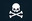

# Cybersecurity Labs & Writeups 

## Cyber Defense Pathway - TryHackMe

## [TryHackMe Cyber Defense Pathway Outline](https://tryhackme.com/path/outline/blueteam)

|                🌐 **Cyber Defense Introduction**                | 🔍 **Threat and Vulnerability Management** |           🛡️ **Security Operations & Monitoring**            |                  🎯 **Threat Emulation**                  |            🧩 **Incident Response and Forensics**             |                       🦠 **Malware Analysis**                       |
| :-------------------------------------------------------------: | :----------------------------------------: | :-----------------------------------------------------------: | :-------------------------------------------------------: | :-----------------------------------------------------------: | :-----------------------------------------------------------------: |
|                 **Tutorial**                |        **Nessus**        |  **Core Windows Processes** |  **Attacktive Directory** |              **Volatility**             |         **History of Malware**        |
|  **Introductory Networking** |         **MITRE**         |            **Sysinternals**           |    **Attacking Kerberos**   |   **Investigating Windows**  |        **MAL: Malware Introductory**       |
|         **Network Services**        |          **Yara**          |      **Windows Event Logs**     |                                                           |     **Windows Forensics 1**    |                 **MAL: Strings**                 |
|       **Network Services 2**      |     **Zero Logon**    |                  **Sysmon**                 |                                                           |     **Windows Forensics 2**    |  **Basic Malware RE** |
|            **Wireshark 101**           |       **OpenVAS**       |     **Osquery: The Basics**     |                                                           |                **Redline**                |            **MAL: REMnux - The Redux**            |
|   **Windows Fundamentals 1**  |          **MISP**          |          **Splunk: Basics**          |                                                           |                 **Autopsy**                |                                                                     |
|  **Active Directory Basics** |                                            |                **Splunk 2**               |                                                           |  **Disk Analysis & Autopsy** |                                                                     |

### 📄 TryHackMe Cyber Defense Lab Writeups 📄

|                                                                             **Incident Response & Forensics**                                                                             |                                                                       **Malware Analysis**                                                                        |
| :---------------------------------------------------------------------------------------------------------------------------------------------------------------------------------------: | :---------------------------------------------------------------------------------------------------------------------------------------------------------------: |
|                                          [📝 Autopsy](https://github.com/AustinKruse/Obsidian-Vault/blob/main/Cyber%20Defense%20Labs/Autopsy.md)                                          | [📝 Basic Malware Reverse Engineering](https://github.com/AustinKruse/Obsidian-Vault/blob/main/Cyber%20Defense%20Labs/Basic%20Malware%20Reverse%20Engineering.md) |
|                      [📝 Disk Analysis & Autopsy](https://github.com/AustinKruse/Obsidian-Vault/blob/main/Cyber%20Defense%20Labs/Disk%20Analysis%20%26%20Autopsy.md)                      |                                                                                                                                                                   |
|                           [📝 Investigation Windows](https://github.com/AustinKruse/Obsidian-Vault/blob/main/Cyber%20Defense%20Labs/Investigating%20Windows.md)                           |                                                                                                                                                                   |
|                         [📝 Redline & IOC Editor](https://github.com/AustinKruse/Obsidian-Vault/blob/main/Cyber%20Defense%20Labs/Redline%20%26%20IOC%20Editor.md)                         |                                                                                                                                                                   |
| [📝 Volatility - Memory Forensics](https://github.com/AustinKruse/Obsidian-Vault/blob/main/Cyber%20Defense%20Labs/Volatility%20-%20Memory%20Forensics%20THM%20Walkthrough%20(Windows).md) |                                                                                                                                                                   |
|                            [📝 Windows Forensics 1](https://github.com/AustinKruse/Obsidian-Vault/blob/main/Cyber%20Defense%20Labs/Windows%20Forensics%201.md)                            |                                                                                                                                                                   |
|                            [📝 Windows Forensics 2](https://github.com/AustinKruse/Obsidian-Vault/blob/main/Cyber%20Defense%20Labs/Windows%20Forensics%202.md)                            |                                                                                                                                                                   |
## SOC Level 1 - TryHackMe
### 📄 TryHackMe SOC Level 1 - Lab Writeups 📄
| **Cyber Defense Frameworks** | **Cyber Threat Intel** |
| :--------------------------: | :--------------------: |
|         [📝Summit]()         |                        |
|                              |                        |
|                              |                        |
|                              |                        |
|                              |                        |
|                              |                        |
|                              |                        |

Future Labs
-------------------------------------------------
- https://tryhackme.com/r/room/adcertificatetemplates
- https://tryhackme.com/r/room/splunk201
- https://tryhackme.com/r/room/investigatingwithsplunk

Future Pathways
--------------------------------------------------
- https://tryhackme.com/r/path/outline/soclevel1 (in-progress)
- https://tryhackme.com/r/path/outline/soclevel2

