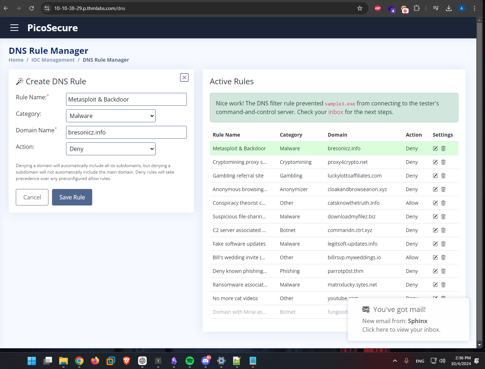

# Summary

```
Austin
10/5/2024

TLDR;
1. Provided a dashboard with a Sandbox, Firewall, Hash Manager, DNS Filter & Sigma Rule Builder; 

2. Provided 6 malware samples (with different evasion techniques) & tasked with blocking them from network using above dahsboard tools. 

3. After successfully blocking each malware sample, the flag is provided.
```

Provided a dashboard with a Sandbox, Firewall, Hash Manager, DNS Filter & Sigma Rule Builder block the provided sample.exe's from the network.  This is an interactive lab, where once you complete an objective, there is a Mail tab that will show you further instructions.

Objective

After participating in one too many incident response activities, PicoSecure has decided to conduct a threat simulation and detection engineering engagement to bolster its malware detection capabilities. You have been assigned to work with an external penetration tester in an iterative purple-team scenario. The tester will be attempting to execute malware samples on a simulated internal user workstation. At the same time, you will need to configure PicoSecure's security tools to detect and prevent the malware from executing.

Following the **Pyramid of Pain's** ascending priority of indicators, your objective is to increase the simulated adversaries' cost of operations and chase them away for good. Each level of the pyramid allows you to detect and prevent various indicators of attack.

Room Prerequisites

Completing the preceding rooms in the [Cyber Defence Frameworks module](https://tryhackme.com/module/cyber-defence-frameworks) will be beneficial before venturing into this challenge. Specifically, the following:

- [The Pyramid of Pain](https://tryhackme.com/room/pyramidofpainax)
- [MITRE](https://tryhackme.com/room/mitre)

Connection Details

Please click **Start Machine** to deploy the application, and navigate to [https://10-10-38-29.p.thmlabs.com](https://10-10-38-29.p.thmlabs.com/) once the URL has been populated. (This VM is only live while doing the module, therefore this link will not work anymore)

## Questions

1. What is the first flag you receive after successfully detecting sample1.exe?

```
THM{f3cbf08151a11a6a331db9c6cf5f4fe4}
```
By taking a look at the first email, we are provided with `sample1.exe`.  


After using the sandbox to analyze it, we are provided with the hash(es).  

I took the MD5 hash, went to the `Manage Hashes` tab & added a rule for the MD5 Hash `cbda8ae000aa9cbe7c8b982bae006c2a` & got a confirmation pop up & the flag.


2. What is the second flag you receive after successfully detecting sample2.exe?

```
THM{2ff48a3421a938b388418be273f4806d}
```
The above screenshot shows the `sample2.exe`, after using the sandbox we see:


Per the email containing the flag for question 1, I need to do more to block this sample due to the fact that hashes are changed so easily.  Only one byte needs to be changed, or even just a comment added & once recompiled the new binary will not have the same hash therefore bypassing the rule.

For `sample2.exe` we see it connecting to `154.35.10.113:4444`.
Going to the `Firewall Rule Manager` tab we can see options for setting up a firewall rule.
- Ingress: Controls traffic entering a network
- Egress: Controls traffic leaving a network

So, lets try this:


Nice! We successfully prevented `sample2.exe` from connecting to its C2 Server. 


3. What is the third flag you receive after successfully detecting sample3.exe?

```
THM{4eca9e2f61a19ecd5df34c788e7dce16}
```
Here is the sandbox output: 


The connections to websites similar to `Microsoft` is usually used by the malware to determine connectivity & throw off anti-virus. 
This sample connects to the same DNS: `emudyn.bresonicz.info` for the C2 server & for the `backdoor.exe` download.  Lets create a DNS rule to deny traffic to & from it.  (This is better than the IP in some aspects, i.e. if the C2 server IP changes, the rule would be bypassed)

\


4. What is the fourth flag you receive after successfully detecting sample4.exe?

```
THM{c956f455fc076aea829799c0876ee399}
```
Here is the sandbox scan results:


For this sample, we can detect if the Windows Defender Realtime Monitoring Registry is modified by creating a `Sigma Rule` using the `Sigma Rule Builder`.


After clicking `Validate Rule` we see the new rule created:


After submitting the rule, we get an email confirmation containing the flag & the next sample.


5. What is the fifth flag you receive after successfully detecting sample5.exe?

```
THM{46b21c4410e47dc5729ceadef0fc722e}
```
The above screenshot contains the email we get, containing a `outgoing_connections.log` file, which is logs of the outgoing network connections from the last 12 hours on the victim machine.


Immediately, I notice that there are multiple Destination IP's, but one in particular `51.102.10.19` consistently has a size of `97 bytes`.  This particular communication is also in perfect 30 minute intervals, which is definitely noteworthy.  

This appears to be a `still alive` function, to determine if the infected host is still connected to the C2 server or not.

Using the `Sigma Rule Builder` again, we select `Sysmon Event Logs` just like in the last question, but for the 2nd step we select `Network Connections`.  


This will detect `Any` network connections where the size of the connection is `97 bytes` & in `1800` seconds (30 minute) intervals. 

After selecting `Validate Rule` we see the created rule:


We also get another email, containing the flag & instructions on the next question.


6. What is the final flag you receive from Sphinx?

```
THM{c8951b2ad24bbcbac60c16cf2c83d92c}
```
We are provided with `commands.log` that contains the commands the attacker uses & in what order.


The commands starting with `dir` are going to output the filenames & directory names inside of the directory provided.  For example, the first line is appending the output of `dir c:\` to `%temp%\exfiltr8.log`.  

So, the first 4 commands are obtaining filenames & directory names for `C:\`, `C:\Documents and Settings`, `C:\Program Files\`, & for the `D:\` drive (if it exists).  Add, 

The next command `net localgroup administrator` (I believe its supposed to be `administrators`, including a `s`), but it would add the usernames of the `administrators` group to the `exfiltr8.log` file.

The `ver` command will output the version of windows, although Windows 11 will still show as Windows 10 due to the command prompt & PowerShell moving to the `Terminal` application.

`systeminfo` - outputs general OS info
`ipconfig /all` - interface information
`netstat -ano` - TCP connections, `a` - all, `n` - IP/MAC in number format, `o` - shows process ID
`net start` - lists all network services running


After validating this rule, we get sent back to the inbox & we have the last flag.


# Sources
 -  https://attack.mitre.org/techniques/enterprise/ 