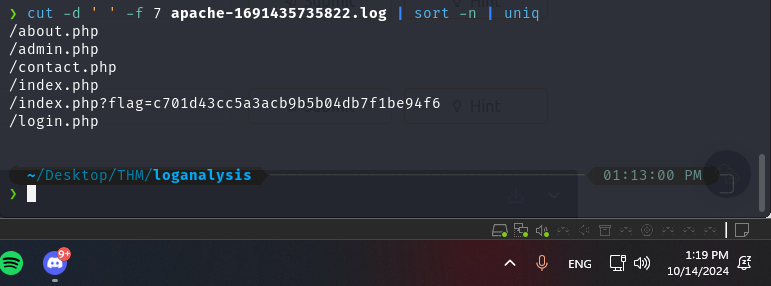
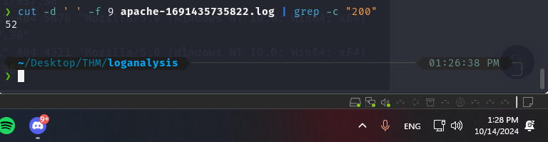
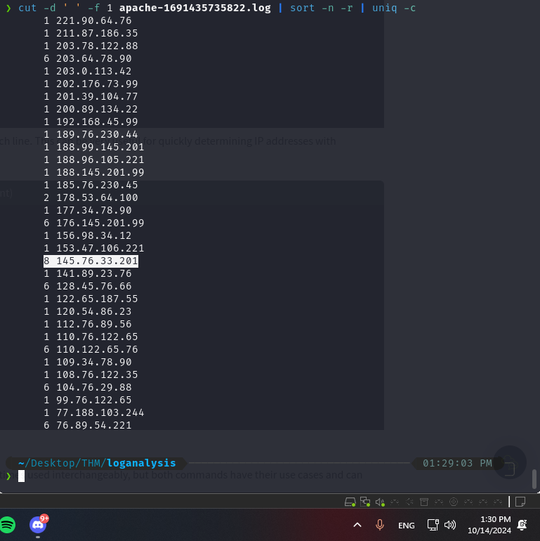
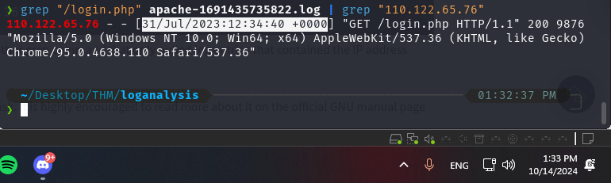
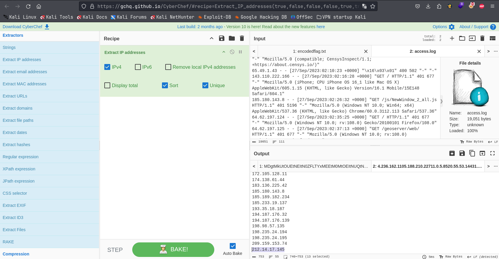
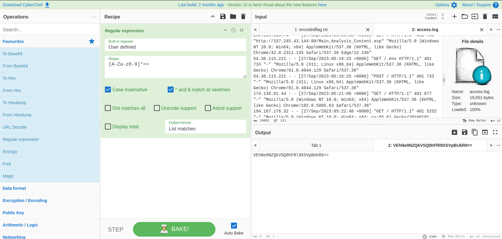
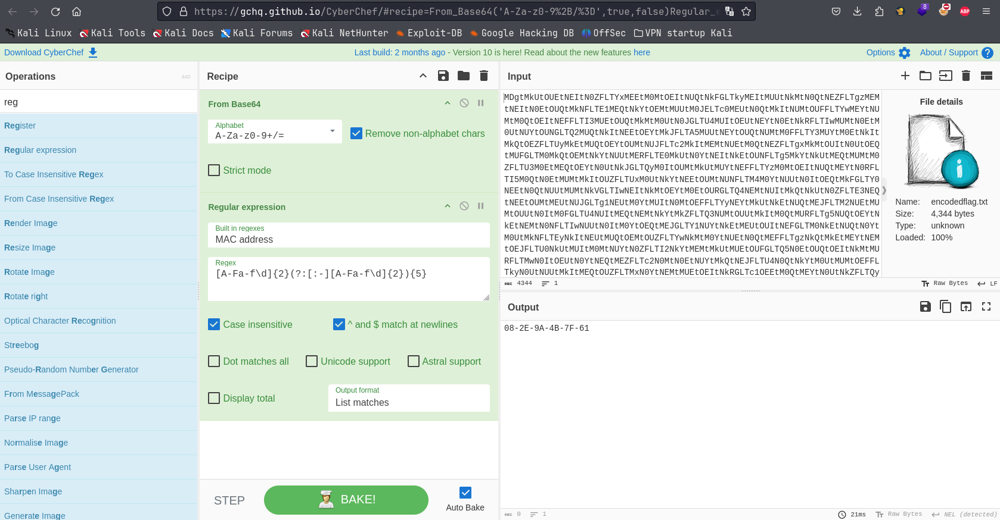

```TLDR
Name: Austin
Date: 10/14/2024

SOC 2 Path, Intro to Log Analysis

Topics/Commands Used: 
 - cat
 - less
 - head
 - tail
 - wc
 - cut
 - sort
 - uniq
 - sed
 - awk
 - grep

To filter a provided apache log file.  Commands & Answers provided.

I have my Linux Essentials cert, so this was basically review but more practical since it included example log files.
```

# Summary
Using CLI commands: **cat**, **less**, **head**, **tail**, **wc**, **cut**, **sort**, **uniq**, **sed**, **awk**, **grep** - to obtain requested information from an `apache.log` file.
## Questions

1. **Use cut on the apache.log file to return only the URLs. What is the flag that is returned in one of the unique entries?**

```
c701d43cc5a3acb9b5b04db7f1be94f6
```
By using the command `cut -d ' ' -f 7 apache-1691435735822.log` we can see all the URL's from the file, scrolling through them will show the answer.  To remove duplicates we can append `sort` & `uniq` commands, i.e.: `cut -d ' ' -f 7 apache-1691435735822.log | sort -n | uniq` 


2. **In the apache.log file, how many total HTTP 200 responses were logged?**

```
52
```
using `cut -d ' ' -f 9 apache-1691435735822.log` we get the HTTP status codes, we can pipe that into `grep -c "200"` to get a count; final command: `cut -d ' ' -f 9 apache-1691435735822.log | grep -c "200"`


3. **In the apache.log file, which IP address generated the most traffic?**

```
145.76.33.201
```
Using `cut`, `sort`, and `uniq -c` we can see the number of times each IP appears in the logs, final command: `cut -d ' ' -f 1 apache-1691435735822.log | sort -n -r | uniq -c`


4. **What is the complete timestamp of the entry where 110.122.65.76 accessed /login.php?**

```
31/Jul/2023:12:34:40 +0000
```
using `grep` piped into another `grep` search, we can find the line we are looking for, final command: `grep "/login.php" apache-1691435735822.log | grep "110.122.65.76"`


## Sources & Take-Aways

- `cut` command 
	- `cut -d ' ' -f 7 apache-1691435735822.log` # -d delimiter, -f field number.
- `sort -n -r` # -n numerically (sort), -r reverse
- `uniq` # combined with the above command, removes duplicates
- `cut -d ' ' -f 7 apache-1691435735822.log | sort -n -r | uniq` # example of sort & uniq being combined to remove duplicates
- `grep "/login.php" apache-1691435735822.log | grep "110.122.65.76"` # example of using grep twice to locate a particular entry for a specific IP
- [`awk` & `sed` Documentation](https://www.theunixschool.com/p/awk-sed.html)
- [Cyber Chef](https://gchq.github.io/CyberChef/) 

# Log Analysis Tools: CyberChef

## Summary
Provided log files, use CyberChef to answer the questions.

## Questions

1. **Upload the log file named "access.log" to CyberChef. Use regex to list all of the IP addresses. What is the full IP address beginning in 212?**

```
212.14.17.145
```
CyberChef has a built in, `Extract IP Addresses` that will show us all the IPv4 addresses, sort them, and remove duplicates with `uniq`:

Though, we can also do this with just Regex: `\b([0-9]{1,3}\.){3}[0-9]{1,3}\b` and look through the results.   We can also filter those results to show just the results with regex `212.*` 


2. **Using the same log file from Question #2, a request was made that is encoded in base64. What is the decoded value?**

```
THM{CYBERCHEF_WIZARD}
```
To search through the log file & find the base64 request, lets use regex:

Now that we have located just the base64 string, lets decode it:


3. **Using CyberChef, decode the file named "encodedflag.txt" and use regex to extract by MAC address. What is the extracted value?**

```
08-2E-9A-4B-7F-61
```
Decoding the file from Base64 & then using regex to extract by Mac Address:

## Sources / Take-Aways
- `[A-Za-z0-9]*==` - Regex to find Base64 strings A-Z (letters A-Z **case sensitive**), a-z (letters a-z **case sensitive**), 0-9 (numbers 0-9), \* for any number of the previously defined characters, `==` is what base64 strings typically end with.
- `\b([0-9]{1,3}\.){3}[0-9]{1,3}\b` - to find IPv4 addresses
- [Cyber Chef](https://gchq.github.io/CyberChef/)  - Easily Regex search for IP, MAC, and many more useful items.